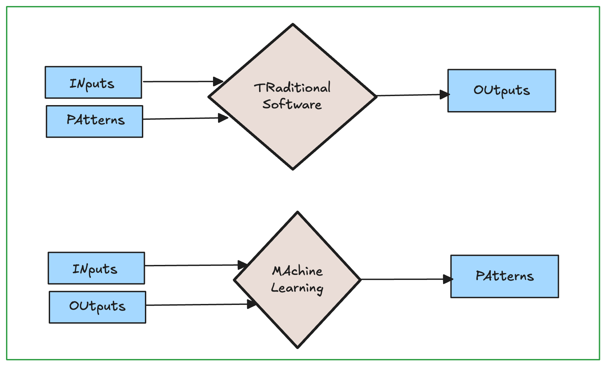
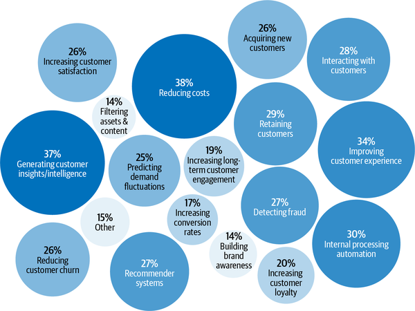

# **Overview of Machine Learning Systems**

This opening chapter aimed to give readers an understanding of what it takes to bring ML into the real world. We started with a tour of the wide range of use cases of ML in production today. While most people are familiar with ML in consumer-facing applications, the majority of ML use cases are for enterprise. We also discussed when ML solutions would be appropriate. Even though ML can solve many problems very well, it can’t solve all the problems and it’s certainly not appropriate for all the problems. However, for problems that ML can’t solve, it’s possible that ML can be one part of the solution.

This chapter also highlighted the differences between ML in research and ML in production. The differences include the stakeholder involvement, computational priority, the properties of data used, the gravity of fairness issues, and the requirements for interpretability. This section is the most helpful to those coming to ML production from academia. We also discussed how ML systems differ from traditional software systems, which motivated the need for this book.

ML systems are complex, consisting of many different components. Data scientists and ML engineers working with ML systems in production will likely find that focusing only on the ML algorithms part is far from enough. It’s important to know about other aspects of the system, including the data stack, deployment, monitoring, maintenance, infrastructure, etc. This book takes a system approach to developing ML systems, which means that we’ll consider all components of a system holistically instead of just looking at ML algorithms. We’ll go into detail what this holistic approach means in the next chapter.

## When to use Machine Learning
To understand what ML can do, let’s examine what ML solutions generally do:

Machine learning is an approach to 

*learn* *complex patterns from* *existing data and use these patterns to make* *predictions on* *unseen data.*

1. **Learn: the system has the capacity to learn**

For an ML system to learn, there must be something for it to learn from. In most
cases, ML systems learn from data. In supervised learning, based on example
input and output pairs, ML systems learn how to generate outputs for arbitrary
inputs.

2. **Complex patterns: there are patterns to learn, and they are complex**

ML solutions are only useful when there are patterns to learn. Sane people
don’t invest money into building an ML system to predict the next outcome
of a fair die because there’s no pattern in how these outcomes are generated.4
However, there are patterns in how stocks are priced, and therefore companies
have invested billions of dollars in building ML systems to learn those patterns.

3. **Existing data: data is available, or it’s possible to collect data**

Because ML learns from data, there must be data for it to learn from. It’s amusing
to think about building a model to predict how much tax a person should pay a
year, but it’s not possible unless you have access to tax and income data of a large population.

Without data and without continual learning, many companies follow a “fake-it-
til-you make it” approach: launching a product that serves predictions made by
humans, instead of ML models, with the hope of using the generated data to train
ML models later.

4. **Predictions: it’s a predictive problem**

ML models make predictions, so they can only solve problems that require
predictive answers. ML can be especially appealing when you can benefit from a
large quantity of cheap but approximate predictions. In English, “predict” means
“estimate a value in the future.” For example, what will the weather be like
tomorrow? Who will win the Super Bowl this year? What movie will a user want
to watch next?

5. **Unseen data: unseen data shares patterns with the training data**

The patterns your model learns from existing data are only useful if unseen data
also share these patterns. 

6. **It’s repetitive**

Humans are great at few-shot learning: you can show kids a few pictures of cats
and most of them will recognize a cat the next time they see one. Despite exciting
progress in few-shot learning research, most ML algorithms still require many
examples to learn a pattern. When a task is repetitive, each pattern is repeated
multiple times, which makes it easier for machines to learn it.

7. **The cost of wrong predictions is cheap**

Unless your ML model’s performance is 100% all the time, which is highly
unlikely for any meaningful tasks, your model is going to make mistakes. ML is
especially suitable when the cost of a wrong prediction is low.

If one prediction mistake can have catastrophic consequences, ML might still be
a suitable solution if, on average, the benefits of correct predictions outweigh the
cost of wrong predictions. Developing self-driving cars is challenging because an
algorithmic mistake can lead to death. However, many companies still want to
develop self-driving cars because they have the potential to save many lives once
self-driving cars are statistically safer than human drivers.

8. **It’s at scale**

ML solutions often require nontrivial up-front investment on data, compute,
infrastructure, and talent, so it’d make sense if we can use these solutions a lot.

9. **The patterns are constantly changing**

Cultures change. Tastes change. Technologies change. What’s trendy today might
be old news tomorrow. Consider the task of email spam classification. Today
an indication of a spam email is a Nigerian prince, but tomorrow it might be a
distraught Vietnamese writer.

## Machine Learning Use Cases

- Recommendation systems
- Predictive typing
- Machine translation
- Personal Assistant
- Speech Recognition system
- Fraud Detection
- Price Optimization
- Identification of potential customers
- Showing better-targeted ads
- Giving discounts at the right time.
- Churn prediction
- Brand monitoring
- Sentiment analysis
- Skin cancer detectation
- Diabetes diagonalization
- etc.

## Understanding Machine Learning Systems

