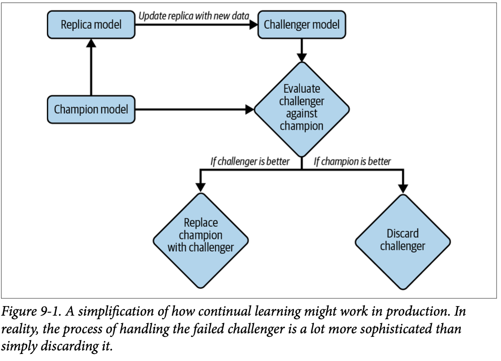
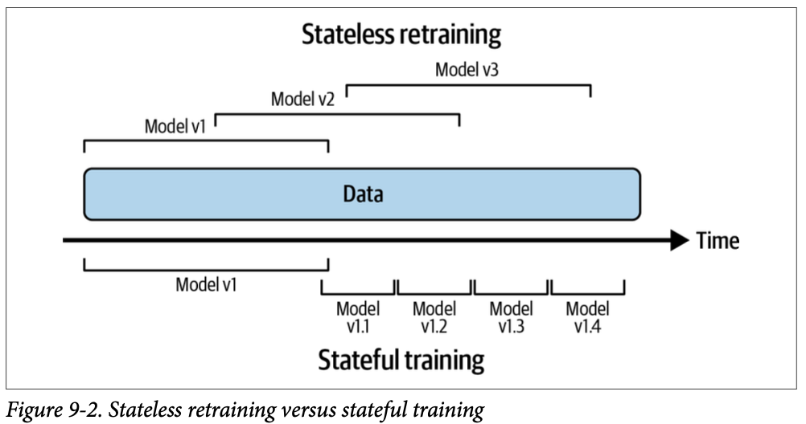
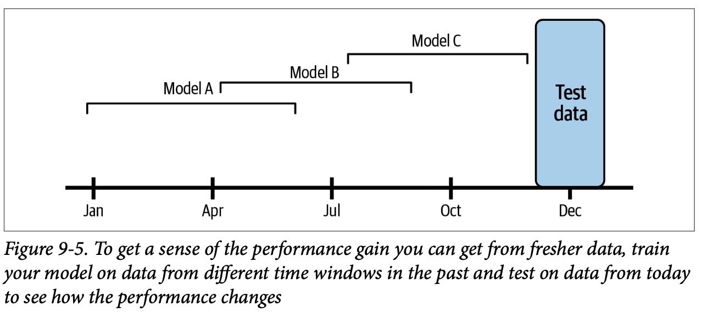
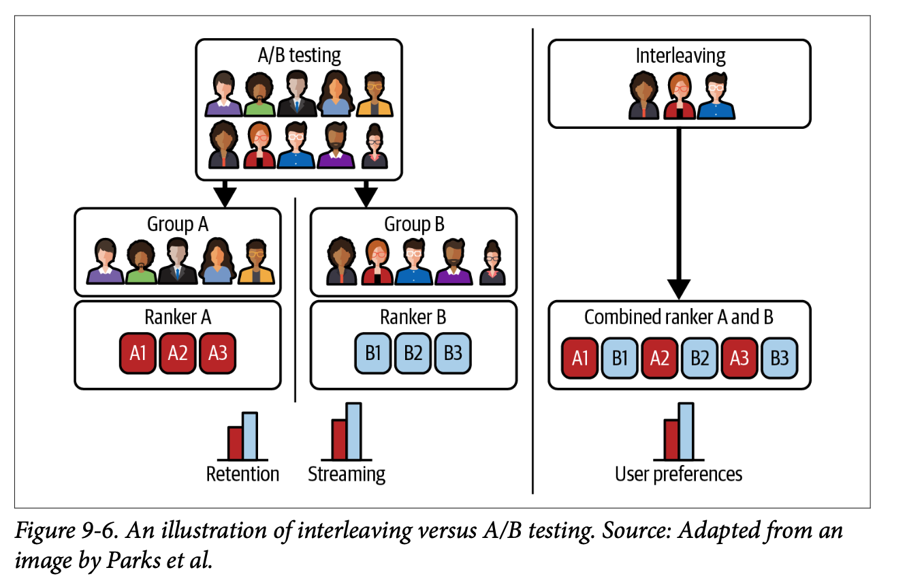

# Continual Learning and Test in Production

The goal of both monitoring and test in production is to understand a model’s performance and figure out when to update it. The goal of continual learning is to safely and efficiently automate the update. All of these concepts allow us to design an `ML system` that is maintainable and adaptable to changing environments.

## Continual Learning

When hearing `“continual learning,”` many people think of the `training paradigm` where a model updates itself with every incoming sample in production. Very few companies actually do that. 

- First, if your model is a neural network, learning with every incoming sample makes it susceptible to `catastrophic forgetting`. Catastrophic
forgetting refers to the tendency of a neural network to completely and abruptly forget previously learned information upon learning new information.1

- Second, it can make training more expensive—most hardware backends today were designed for batch processing, so processing only one sample at a time causes a huge waste of compute power and is unable to exploit data parallelism.

Companies that employ `continual learning` in production update their models in micro-batches. For example, they might update the existing model after every `512` or `1,024` examples—the optimal number of examples in each micro-batch is task dependent.

The updated model shouldn’t be deployed until it’s been evaluated. This means that you shouldn’t make changes to the existing model directly. Instead, you create a `replica` of the existing model and update this replica on new data, and only replace the existing model with the updated replica if the updated `replica` proves to be better. The existing model is called the `champion model`, and the updated replica, the `challenger`.\

### Stateless Retraining Versus Stateful Training

Continual learning isn’t about the retraining frequency, but the manner in which the model is retrained. Most companies do `stateless retraining`—the model is trained from scratch each time. `Continual learning` means also allowing `stateful training`—the model continues training on new data. Stateful training is also known as fine-tuning or incremental learning.

`Stateful training` involves updating a model with new data incrementally, retaining information from previous training sessions, 
while `Stateless training` involves retraining the model from scratch with the entire dataset each time, discarding past training information

**Stateless Training:**

- *Retraining from scratch:*
Stateless training treats each training cycle as independent. It doesn't remember past training data or model states. This approach can be simpler to implement and manage, especially when the data distribution is relatively stable. However, it can suffer from catastrophic forgetting, where the model forgets previously learned knowledge when trained on new data.

- *Example:*
Imagine a student rereading the textbook before each exam. They're prepared for the specific test but haven't retained the information from previous readings. 

**Stateful Training:**

- *Incremental updates:*
Stateful training involves updating the model with new data incrementally, building upon its existing knowledge base. It's generally more efficient as it avoids retraining on the entire dataset each time. It can be challenging to manage changes in `data distribution (concept drift)` or `model architecture`, potentially leading to `performance degradation`.

- *Example:*
Think of a student who gradually builds up their knowledge over time, taking notes and incorporating new information as they learn. They retain past knowledge but need to be aware of how new information might affect their existing understanding. 

Stateful training allows you to update your model with less data. Training a model from scratch tends to require a lot more data than fine-tuning the same model. For example, if you retrain your model from scratch, you might need to use all data from the last three months. However, if you fine-tune your model from yesterday’s checkpoint, you only need to use data from the last day.

One beautiful property that is often overlooked is that with stateful training, it might be possible to avoid storing data altogether. In the traditional stateless retraining, a data sample might be reused during multiple training iterations of a model, which means that data needs to be stored. This isn’t always possible, especially for data with strict privacy requirements. In the stateful training paradigm, each model update is
trained using only the fresh data, so a data sample is used only once for training. 

Once your infrastructure is set up to allow both stateless retraining and stateful training, the training frequency is just a knob to twist. You can update your models once an hour, once a day, or whenever a distribution shift is detected.

Continual learning is about setting up infrastructure in a way that allows you, a data scientist or ML engineer, to update your models whenever it is needed, whether from scratch or fine-tuning, and to deploy this update quickly.

You might wonder: stateful training sounds cool, but how does this work if I want to add a new `feature` or another `layer` to my model? To answer this, we must differentiate two types of model updates:

- `Model iteration`
A new feature is added to an existing model architecture or the model architecture is changed.

- `Data iteration`
The model architecture and features remain the same, but you refresh this model with new data.

### Why Continual Learning?

continual learning is about setting up infrastructure so that you can update your models and deploy these changes as fast as you want. But why would you need the ability to update your models as fast as you want?

The first use case of `continual learning` is to combat `data distribution shifts`, especially when the shifts happen suddenly. Imagine you’re building a model to determine the prices for a ride-sharing service like Lyft. Historically, the ride demand on a Thursday evening in this particular neighborhood is slow, so the model predicts low ride prices, which makes it less appealing for drivers to get on the road. However, on this Thursday evening, there’s a big event in the neighborhood, and suddenly the ride demand surges. If your model can’t respond to this change quickly enough by increasing its price prediction and mobilizing more drivers to that neighborhood, riders will have to wait a long time for a ride, which causes negative user experience. They might even switch to a competitor, which causes you to lose revenue.

A huge challenge for ML production today that continual learning can help overcome is the continuous cold start problem. The cold start problem arises when your model has to make predictions for a new user without any historical data. For example, to recommend to a user what movies they might want to watch next, a recommender system often needs to know what that user has watched before. But if that user is new, you won’t have their watch history and will have to generate them something generic, e.g., the most popular movies on your site right now.

Continuous `cold start` is a generalization of the cold start problem, as it can happen not just with new users but also with existing users. For example, it can happen because an existing user switches from a laptop to a mobile phone, and their behavior on a phone is different from their behavior on a laptop.

If your model doesn’t adapt quickly enough, it won’t be able to make recommendations relevant to these users until the next time the model is updated. By that time, these users might have already left the service because they don’t find anything relevant to them.

If continual learning takes the same effort to set up and costs the same to do as batch learning, there’s no reason not to do continual learning.

### Continual Learning Challenges

Even though continual learning has many use cases and many companies have applied it with great success, continual learning still has many challenges. 

1. **Fresh data access challenge**

The first challenge is the challenge to get fresh data. If you want to update your model every hour, you need new data every hour. Currently, many companies pull new training data from their data warehouses. The speed at which you can pull data from your data warehouses depends on the speed at which this data is deposited into your data warehouses. The speed can be slow, especially if data comes from multiple sources. An alternative is to allow pull data before it’s deposited into data warehouses, e.g., directly from real-time transports such as Kafka and Kinesis that transport data from applications to data warehouses

The best candidates for continual learning are tasks where you can get natural labels with short feedback loops. Examples of these tasks are dynamic pricing (based on estimated demand and availability), estimating time of arrival, stock price prediction, ads click-through prediction, and recommender systems for online content like tweets, songs, short videos, articles, etc.

2. **Evaluation challenge**

The biggest challenge of continual learning isn’t in writing a function to continually update your model—you can do that by writing a script! The biggest challenge is in making sure that this update is good enough to be deployed. 

The risks for catastrophic failures amplify with continual learning. First, the more frequently you update your models, the more opportunities there are for updates to fail.

Second, continual learning makes your models more susceptible to coordinated manipulation and adversarial attack. Because your models learn online from real-world data, it makes it easier for users to input malicious data to trick models into learning wrong things.

3. **Algorithm challenge**

Compared to the `fresh data` challenge and the `evaluation`, this is a `“softer”` challenge as it only affects certain algorithms and certain training frequencies. To be precise, it only affects `matrix-based` and `tree-based` models that want to be updated very fast (e.g., hourly).

To illustrate this point, consider two different models: a `neural network` and a `matrix-based model`, such as a `collaborative filtering` model. The `collaborative filtering` model uses a `user-item matrix` and a `dimension reduction` technique.

You can update the neural network model with a data batch of any size. You can even perform the update step with just one data sample. However, if you want to update the `collaborative filtering` model, you first need to use the entire dataset to build the `user-item matrix` before performing dimensionality reduction on it.

It’s much easier to adapt models like neural networks than matrix-based and tree-based models to the continual learning paradigm. 

### Four Stages of Continual Learning

The four stages on how to overcome continual learning challenges and make continual learning happen.

1. **Stage 1: Manual, stateless retraining**

In the beginning, the ML team often focuses on developing ML models to solve as many business problems as possible. For example, if your company is an ecommerce website, you might develop four models in the following succession:

- A model to detect fraudulent transactions

- A model to recommend relevant products to users

- A model to predict whether a seller is abusing a system

- A model to predict how long it will take to ship an order

Because your team is focusing on developing new models, updating existing models takes a backseat. You update an existing model only when the following two conditions are met: the model’s performance has degraded to the point that it’s doing more harm than good, and your team has time to update it. Some of your models are being
updated once every six months. Some are being updated once a quarter. Some have been out in the wild for a year and haven’t been updated at all.

The process of updating a model is manual and ad hoc. Someone, usually a data engineer, has to query the data warehouse for new data. Someone else cleans this new data, extracts features from it, retrains that model from scratch on both the old and new data, and then exports the updated model into a binary format. Then someone
else takes that binary format and deploys the updated model. Oftentimes, the code encapsulating data, features, and model logic was changed during the retraining process but these changes failed to be replicated to production, causing bugs that are hard to track down.

2. **Stage 2: Automated retraining**

If your company has ML models in production, it’s likely that your company already has most of the infrastructure pieces needed for automated retraining. The feasibility of this stage revolves around the feasibility of writing a script to automate your workflow and configure your infrastructure to automatically:

1. Pull data.

2. Downsample or upsample this data if necessary.

3. Extract features.

4. Process and/or annotate labels to create training data.

5. Kick off the training process.

6. Evaluate the newly trained model.

7. Deploy it.

3. **Stage 3: Automated, stateful training**

In stage 2, each time you retrain your model, you train it from scratch (stateless retraining). It makes your retraining costly, especially for retraining with a higher frequency. why train on data from the last three months every day when you can continue training using only data from the last day?

The main thing you need in this stage is a change in the mindset: retraining from scratch is such a norm—many companies are so used to data scientists handing off a model to engineers to deploy from scratch each time—that many companies don’t think about setting up their infrastructure to enable `stateful training`.

4. **Stage 4: Continual learning**

Instead of relying on a fixed schedule, you might want your models to be automatically updated whenever data distributions shift and the model’s performance plummets.

The holy grail is when you combine continual learning with edge deployment. Imagine you can ship a base model with a new device—a phone, a watch, a drone, etc., and the model on that device will continually update and adapt to its environment as needed without having to sync with a centralized server. There will be no need for a centralized server, which means no centralized server cost. There will also be no need to transfer data back and forth between device and cloud, which means better data security and privacy!

The move from stage 3 to stage 4 is steep. You’ll first need a mechanism to trigger model updates. This trigger can be:

- `Time-based:` For example, every five minutes.

- `Performance-based:` For example, whenever model performance plummets

- `Volume-based:` For example, whenever the total amount of labeled data increases by 5%

- `Drift-based:` For example, whenever a major data distribution shift is detected

You’ll also need a solid pipeline to continually evaluate your model updates. Writing a function to update your models isn’t much different from what you’d do in `stage 3`. The hard part is to ensure that the updated model is working properly. 

### How Often to Update Your Models

Now that your infrastructure has been set up to update a model quickly, you started asking the question that has been haunting ML engineers at companies of all shapes and sizes: `“How often should I update my models?”` Before attempting to answer that question, we first need to figure out how much gain your model will get from being updated with fresh data. The more gain your model can get from fresher data, the more frequently it should be retrained.

**Value of data freshness** 

The question of how often to update a model becomes a lot easier if we know how much the model performance will improve with updating. For example, if we switch from retraining our model every month to every week, how much performance gain can we get? What if we switch to daily retraining? People keep saying that data distributions shift, so fresher data is better, but how much better is fresher data?

One way to figure out the gain is by training your model on the data from different time windows in the past and evaluating it on the data from today to see how the performance changes. For example, consider that you have data from the year 2020. To measure the value of data freshness, you can experiment with training model
`version A` on the data from `January to June 2020`, model `version B` on the data from `April to September`, and model `version C` on the data from `June to November`, then test each of these model versions on the data from December.

The difference in the performance of these versions will give you a sense of the performance gain your model can get from fresher data. If the model trained on data from a quarter ago is much worse than the model trained on data from a month ago, you know that you shouldn’t wait a quarter to retrain your model.

**Model iteration versus data iteration**

You might wonder not only how often to update your model, but also what kind of model updates to perform. In theory, you can do both types of updates, and in practice, you should do both from time to time. However, the more resources you spend in one approach, the fewer resources you can spend in another.

On the one hand, if you find that iterating on your data doesn’t give you much performance gain, then you should spend your resources on finding a better model. On the other hand, if finding a better model architecture requires `100X compute` for training and gives you `1%` performance whereas updating the same model on data from the last three hours requires only `1X` compute and also gives `1%` performance gain, you’ll be better off iterating on data.

## Test in Production

The first type of model evaluation you might think about is the good old test splits that you can use to evaluate your models offline. These test splits are usually static and have to be static so that you have a trusted benchmark to compare multiple models. It’ll be hard to compare the test results of two models if
they are tested on different test sets.

However, if you update the model to adapt to a new data distribution, it’s not sufficient to evaluate this new model on test splits from the old distribution. Assuming that the fresher the data, the more likely it is to come from the current distribution, one idea is to test your model on the most recent data that you have access to. So, after you’ve updated your model on the data from the last day, you might want to test this model on the data from the last hour (assuming that data from the last hour wasn’t included in the data used to update your model). The method of testing a predictive model on data from a specific period of time in the past is known as a `backtest`.

The question is whether backtests are sufficient to replace static test splits. Not quite. If something went wrong with your data pipeline and some data from the last hour is corrupted, evaluating your model solely on this recent data isn’t sufficient.

With backtests, you should still evaluate your model on a static test set that you have extensively studied and (mostly) trust as a form of sanity check.

Because data distributions shift, the fact that a model does well on the data from the last hour doesn’t mean that it will continue doing well on the data in the future. The only way to know whether a model will do well in production is to deploy it. This insight led to one seemingly terrifying but necessary concept: test in production. However, test in production doesn’t have to be scary. There are techniques to help you evaluate your models in production (mostly) safely. 

Here are the following techniques for Online Evaluation:

1. **Shadow Deployment**

Shadow deployment might be the safest way to deploy your model or any software update. Shadow deployment works as follows:

- Deploy the candidate model in parallel with the existing model.

- For each incoming request, route it to both models to make predictions, but only serve the existing model’s prediction to the user.

- Log the predictions from the new model for analysis purposes.

Only when you’ve found that the new model’s predictions are satisfactory do you replace the existing model with the new model.

Because you don’t serve the new model’s predictions to users until you’ve made sure that the model’s predictions are satisfactory, the risk of this new model doing something funky is low, at least not higher than the existing model. However, this technique isn’t always favorable because it’s expensive. It doubles the number of predictions your system has to generate, which generally means doubling your inference
compute cost.

2. **A/B Testing**

`A/B testing` is a way to compare two variants of an object, typically by testing responses to these two variants, and determining which of the two variants is more effective. In our case, we have the existing model as one variant, and the candidate model (the recently updated model) as another variant. We’ll use `A/B testing` to determine which model is better according to some predefined metrics.

**A/B testing works as follows:**

- Deploy the candidate model alongside the existing model.

- A percentage of traffic is routed to the new model for predictions; the rest is routed to the existing model for predictions. It’s common for both variants to serve prediction traffic at the same time.

- Monitor and analyze the predictions and user feedback, if any, from both models to determine whether the difference in the two models’ performance is statistically significant.

A/B test should be run on a sufficient number of samples to gain enough confidence about the outcome. Often, in production, you don’t have just one candidate but multiple candidate models. It’s possible to do `A/B testing` with more than two variants, which means we can have `A/B/C testing` or even `A/B/C/D testing`.

3. **Canary Release**

Canary release is a technique to reduce the risk of introducing a new software version in production by slowly rolling out the change to a small subset of users before rolling it out to the entire infrastructure and making it available to everybody. In the context of ML deployment, canary release works as follows:

- Deploy the candidate model alongside the existing model. The candidate model is called the `canary`.

- A portion of the traffic is routed to the `candidate model`.

- If its performance is satisfactory, increase the traffic to the `candidate model`. If not, abort the canary and route all the traffic back to the existing model.

- Stop when either the canary serves all the traffic (the candidate model has replaced the existing model) or when the canary is aborted.

The `candidate model’s` performance is measured against the existing model’s performance according to the metrics you care about. If the candidate model’s key metrics degrade significantly, the canary is aborted and all the traffic will be routed to the existing model.

Canary releases can be used to implement `A/B testing` due to the similarities in their setups. However, you can do `canary analysis` without `A/B testing`. For example, you don’t have to randomize the traffic to route to each model. A plausible scenario is that you first roll out the candidate model to a less critical market before rolling out to everybody.

4. **Interleaving Experiments**

Imagine you have two recommender systems, `A and B`, and you want to evaluate which one is better. Each time, a model recommends 10 items users might like. With `A/B testing`, you’d divide your users into two groups: one group is exposed to `A` and the other group is exposed to `B`. Each user will be exposed to the recommendations
made by one model.

What if instead of exposing a user to recommendations from a model, we expose that user to recommendations from both models and see which model’s recommendations they will click on? That’s the idea behind `interleaving experiments`.

When we show recommendations from multiple models to users, it’s important to note that the position of a recommendation influences how likely a user will click on it. For example, users are much more likely to click on the top recommendation than the bottom recommendation. For interleaving to yield valid results, we must
ensure that at any given position, a recommendation is equally likely to be generated by `A` or `B`. To ensure this, one method we can use is team-draft interleaving, which mimics the drafting process in sports. For each recommendation position, we randomly select `A` or `B` with equal probability, and the chosen model picks the top recommendation that hasn’t already been picked.

5. **Bandits**

Multi-armed bandits are algorithms that allow you to balance
between exploitation (choosing the slot machine that has paid the most in the past)
and exploration (choosing other slot machines that may pay off even more).

However, bandits are a lot more difficult to implement than A/B testing because
it requires computing and keeping track of models’ payoffs. Therefore, bandit algo‐
rithms are not widely used in the industry other than at a few big tech companies.

## Summary

This chapter touches on how to continually update your models in production to adapt them to changing data distributions. We discussed the four stages a company might go through in the process of modernizing their infrastructure for continual learning: from the manual, training from scratch stage to automated, stateless continual learning.

We then examined the question that haunts ML engineers at companies of all shapes and sizes, `“How often should I update my models?”` by urging them to consider the value of data freshness to their models and the trade-offs between model iteration and data iteration.

Continual learning requires a mature streaming infrastructure. The training part of continual learning can be
done in batch, but the online evaluation part requires streaming. Many engineers worry that streaming is hard and costly. It was true three years ago, but streaming technologies have matured significantly since then. More and more companies are providing solutions to make it easier for companies to move to streaming, including
`Spark Streaming`, `Snowflake Streaming`, `Materialize`, `Decodable`, `Vectorize`, etc.

Continual learning is a problem specific to ML, but it largely requires an infrastructural solution. To be able to speed up the iteration cycle and detect failures in new model updates quickly, we need to set up our infrastructure in the right way. This requires the data science/ML team and the platform team to work together.

