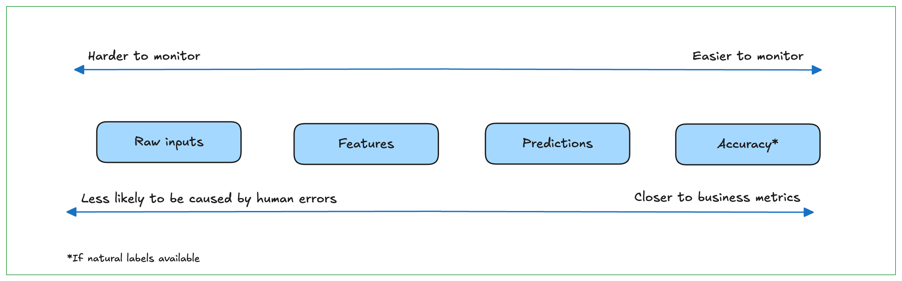

# Data Distribution Shifts and Monitoring

Deploying a model isn't the end of the ML process. A model’s performance degrades over time in production. Once a model has been deployed, we still
have to continually monitor its performance to detect issues as well as deploy updates to fix these issues. To understand failures of ML systems, we differentiated between two types of failures: `software systems failures` (failures that also happen to non-ML systems) and `ML-specific failures`. Even though the majority of ML failures today are non-ML-specific, as tooling and infrastructure around MLOps matures, this might change.

One prevalent and thorny issue that affects almost all ML models in production is `Data distribution shifts`. This occurs when the data distribution in production differs and diverges from the data distribution the model was exposed to during training.

## Causes of ML System Failures

A failure happens when one or more expectations of the system is violated. In traditional software, we mostly care about a system’s operational expectations: whether the system executes its logic within the expected operational metrics, e.g., latency and throughput.

For an ML system, we care about both its `operational metrics` and its `ML performance metrics`. For example, consider an English-French machine translation system. Its operational expectation might be that, given an English sentence, the system returns a French translation within a one-second latency. Its ML performance expectation is that the returned translation is an accurate translation of the original English
sentence 99% of the time. If you enter an English sentence into the system and don’t get back a translation, the first expectation is violated, so this is a system failure.

If you get back a translation that isn’t correct, it’s not necessarily a system failure because the accuracy expectation allows some margin of error. However, if you keep entering different English sentences into the system and keep getting back wrong translations, the second expectation is violated, which makes it a `system failure`.

ML performance expectation violations are harder to detect as doing so requires measuring and monitoring the performance of ML models in production. 

To effectively detect and fix ML system failures in production, it’s useful to understand why a model, after proving to work well during development, would fail in production. We’ll examine two types of failures: `software system failures` and `ML-specific failures`.

### Software System Failures

Software system failures are failures that would have happened to non-ML systems. Here are some examples of software system failures:

1. **Dependency failure:**

A software package or a codebase that your system depends on breaks, which leads your system to break. This failure mode is common when the dependency is maintained by a third party, and especially common if the third party that maintains the dependency no longer exists.

2. **Deployment failure:**

Failures caused by deployment errors, such as when you accidentally deploy the binaries of an older version of your model instead of the current version, or when your systems don’t have the right permissions to read or write certain files.

3. **Hardware failures:**

When the hardware that you use to deploy your model, such as CPUs or GPUs, doesn’t behave the way it should. For example, the CPUs you use might overheat and break down.

4. **Downtime or crashing:**

If a component of your system runs from a server somewhere, such as AWS or a hosted service, and that server is down, your system will also be down.

Addressing software system failures requires not `ML` skills, but traditional software engineering skills, Because of the importance of traditional software engineering skills in deploying `ML` systems, `ML engineering` is mostly engineering, not `ML`.

### ML-Specific Failures

ML-specific failures are failures specific to ML systems. Examples include data collection and processing problems, poor hyperparameters, changes in the training pipeline not correctly replicated in the inference pipeline and vice versa, data distribution shifts that cause a model’s performance to deteriorate over time, edge cases, and degenerate feedback loops.

1. **Production data differing from training data**

The assumption that the unseen data to come from the same stationary distribution as the training data distribution is incorrect in most cases for two reasons. First, the underlying distribution of the real-world data is unlikely to be the same as the underlying distribution of the training data.  

Curating a training dataset that can accurately represent the data that a model will encounter in production turns out to be very difficult.
Real-world data is multifaceted and, in many cases, virtually infinite, whereas training data is finite and constrained by the time, compute, and human resources available during the dataset creation and processing. 

Another common failure mode is that a model does great when first deployed, but its performance degrades over time as the data distribution changes. This failure mode needs to be continually monitored and detected for as long as a model remains in production.

Due to the complexity of ML systems and the poor practices in deploying them, a large percentage of what might look like data shifts on monitoring dashboards are caused by internal errors, such as bugs in the data pipeline, missing values incorrectly inputted, inconsistencies between the features extracted during training and inference, features standardized using statistics from the wrong subset of data, wrong model version, or bugs in the app interface that force users to change their behaviors.

2. **Edge cases**

Edge cases are the data samples so extreme that they cause the model to make catastrophic mistakes. Even though edge cases generally refer to data samples drawn from the same distribution, if there is a sudden increase in the number of data samples in which your model doesn’t perform well, it could be an indication that the underlying data distribution has shifted.

3. **Degenerate feedback loops**

A degenerate feedback loop can happen when the predictions themselves influence the feedback, which, in turn, influences the next iteration of the model. More formally, a degenerate feedback loop is created when a system’s outputs are used to generate the system’s future inputs, which, in turn, influence the system’s future outputs. In ML, a system’s predictions can influence how users interact with the system, and because
users’ interactions with the system are sometimes used as training data to the same system, degenerate feedback loops can occur and cause unintended consequences. Degenerate feedback loops are especially common in tasks with natural labels from users, such as recommender systems and ads click-through-rate prediction.

4. **Detecting degenerate feedback loops**

If degenerate feedback loops are so bad, how do we know if a feedback loop in a system is degenerate? When a system is offline, degenerate feedback loops are difficult to detect. Degenerate loops result from user feedback, and a system won’t have users until it’s online (i.e., deployed to users).

For the task of recommender systems, it’s possible to detect degenerate feedback loops by measuring the popularity diversity of a system’s outputs even when the system is offline. An item’s popularity can be measured based on how many times it has been interacted with (e.g., seen, liked, bought, etc.) in the past.

If a recommender system is much better at recommending popular items than recommending less popular items, it likely suffers from popularity bias.16 Once your system is in production and you notice that its predictions become more homogeneous over time, it likely suffers from degenerate feedback loops.

5. **Correcting degenerate feedback loops**

We’ve discussed that degenerate feedback loops can cause a system’s outputs to be more homogeneous over time. Introducing randomization in the predictions can reduce their homogeneity. In the case of recommender systems, instead of showing the users only the items that the system ranks highly for them, we show users random items and use their feedback to determine the true quality of these items. This is the approach that TikTok follows. Each new video is randomly assigned an initial pool of traffic (which can be up to hundreds of impressions). This pool of traffic is used to evaluate each video’s unbiased quality to determine whether it should be moved to a bigger pool of traffic or be marked as irrelevant.

Randomization has been shown to improve diversity, but at the cost of user experience. Showing our users completely random items might cause users to lose interest
in our product. 

## Data Distribution Shifts (Data Drift)

`Data distribution shift` (also known as `Data Drift`) refers to the phenomenon in `supervised learning` when the data a model works with changes over time, which causes this model’s predictions to become less accurate as time passes. The distribution of the data the model is trained on is called the `source distribution`. The distribution of the data the model runs inference on is called the `target distribution`.

Data distribution shift refers to changes in the input data's characteristics (features) over time, while concept drift signifies a change in the relationship between the input features and the target variable (the thing you're trying to predict).

### Types of Data Distribution Shifts

1. **Covariate shift (or Data Drift):**

Occurs when the distribution of the input features (covariates, $(X)$) changes, but the relationship between the features and the target 
variable $((Y))$, i.e., $(P(Y|X))$, remains the same. 

For example, a model trained to predict house prices in a specific city might experience covariate shift if it's then deployed in a different city with a different distribution of house sizes, number of bedrooms, etc., but the fundamental relationship between these features and price remains consistent.

Mathematically, `covariate shift` is when $P(X)$ changes, but $P(Y|X)$ remains the same, which means that the distribution of the input changes, but the conditional probability of an output given an input remains the same.

If you know in advance how the real-world input distribution will differ from your training `input distribution`, you can leverage techniques such as `importance weighting` to train your model to work for the real-world data. `Importance weighting` consists of two steps: 
- estimate the density ratio between the real-world input distribution and
- the training input distribution, 
then weight the training data according to this ratio and train an ML model on this weighted data.

`Importance weighting` is a technique that assigns different weights to training examples based on their importance or relevance. This is particularly useful when dealing with data distributions that differ between the training and testing environments (distribution shift) or when certain examples are more informative than others. By adjusting the weights, importance weighting can help mitigate bias and improve model performance on the target distribution or task. 

2. **Label shift:**

Occurs when the distribution of the target variable (labels, $(Y)$) changes, but the conditional distribution of features given the label, i.e., 
$(P(X|Y))$, remains the same. 

This is essentially the inverse of covariate shift. For instance, in an email spam classification model, if the proportion of spam emails drastically increases or decreases, but the characteristics of spam and non-spam emails remain the same, that's label shift.

Label shift, also known as `prior shift`, `prior probability shift`, or `target shift`, is when $P(Y)$ changes but $P(X|Y)$ remains the same. You can think of this as the case when the output distribution changes but, for a given output, the input distribution stays the same.

3. **Concept Shift/Drift:**

Occurs when the underlying relationship between the input features $((X))$ and the target variable $((Y))$ changes, i.e., $(P(Y|X))$ changes. This means that for the same input features, the expected output changes. 

For example, a model predicting customer churn might experience concept drift if a new marketing strategy or competitor emerges, altering the factors that influence customer retention, even if the customer demographics (input features) remain stable. 

`Concept drift`, also known as `posterior shift`, is when the input distribution remains the same but the conditional distribution of the output given an input changes. You can think of this as “same input, different output.” 

In many cases, concept drifts are cyclic or seasonal. For example, rideshare prices will fluctuate on weekdays versus weekends, and flight ticket prices rise during holiday seasons. Companies might have different models to deal with cyclic and seasonal drifts. For example, they might have one model to predict rideshare prices on weekdays and another model for weekends.

**In summary:**
      
- Covariate Shift: $(P(X)$)$ changes, $(P(Y|X))$ stays the same. 

- Label Shift: $(P(Y))$ changes, $(P(X|Y))$ stays the same. 

- Concept Shift/Drift: $(P(Y|X))$ changes.

### General Data Distribution Shifts

There are other types of changes in the real world that, even though not well studied in research, can still degrade your models’ performance.

- `feature change`: 

One is feature change, such as when new features are added, older features are removed, or the set of all possible values of a feature changes.

- `Label schema change`: 

Label schema change is when the set of possible values for `Y` change. With label shift, $P(Y)$ changes but $P(X|Y)$ remains the same. With label schema change, both $P(Y)$ and $P(X|Y)$ change. A schema describes the structure of the data, so the label schema of a task describes the structure of the labels of that task. For example, a dictionary that maps from a class to an integer value, such as ${“POSITIVE”: 0, “NEGATIVE”: 1}$, is a schema.

When the number of classes changes, your model’s structure might change, and you might need to both relabel your data and retrain your model from scratch. Label schema change is especially common with high-cardinality tasks—tasks with a high number of classes—such as product or documentation categorization.

There’s no rule that says that only one type of shift should happen at one time. A model might suffer from multiple types of drift, which makes handling them a lot more difficult.

### Detecting Data Distribution Shifts

`Data distribution shifts` are only a problem if they cause your model’s performance to degrade. So the first idea might be to monitor your model’s `accuracy-related` metrics— `accuracy`, `F1 score`, `recall`, `AUC-ROC`, etc. in production to see whether they have changed. “Change” here usually means “decrease,” but if my model’s accuracy suddenly goes up or fluctuates significantly for no reason that I’m aware of, I’d want to investigate.

Accuracy-related metrics work by comparing the model’s predictions to ground truth labels.30 During model development, you have access to labels, but in production, you don’t always have access to labels, and even if you do, labels will be delayed.

When ground truth labels are unavailable or too delayed to be useful, we can monitor other distributions of interest instead. The distributions of interest are the input distribution $P(X)$, the label distribution $P(Y)$, and the conditional distributions $P(X|Y)$ and $P(Y|X)$.

While we don’t need to know the ground truth labels `Y` to monitor the input distribution, monitoring the label distribution and both of the conditional distributions require knowing `Y`. In research, there have been efforts to understand and detect label shifts without labels from the target distribution. 

1 **Statistical methods**

In industry, a simple method many companies use to detect whether the two distributions are the same is to compare their statistics like `min`, `max`, `mean`, `median`, `variance`, various quantiles (such as `5th`, `25th`, `75th`, or `95th` quantile), `skewness`, `kurtosis`, etc. For example, you can compute the `median` and `variance` of the values of a feature during inference and compare them to the metrics computed during training. 

The Mean, median, and variance are only useful with the distributions for which the mean/median/variance are useful summaries. If those metrics differ significantly, the inference distribution might have shifted from the
training distribution. However, if those metrics are similar, there’s no guarantee that there’s no shift.

A more sophisticated solution is to use a two-sample hypothesis test, shortened as two-sample test. It’s a test to determine whether the difference between two populations (two sets of data) is statistically significant. If the difference is statistically significant, then the probability that the difference is a random fluctuation due to sampling variability is very low, and, therefore, the difference is caused by the fact that these two populations come from two distinct distributions.

A basic two-sample test is the `Kolmogorov–Smirnov test`, also known as the `K-S` or `KS test`. It’s a nonparametric statistical test, which means it doesn’t require any parameters of the underlying distribution to work. It doesn’t make any assumption about the underlying distribution, which means it can work for any distribution.

Because two-sample tests often work better on low-dimensional data than on high-dimensional data, it’s highly recommended that you reduce the dimensionality of your data before performing a two-sample test on it.

2. **Time scale windows for detecting shifts**

Not all types of shifts are equal—some are harder to detect than others. For example, shifts happen at different rates, and abrupt changes are easier to detect than slow, gradual changes. Shifts can also happen across two dimensions: `spatial` or `temporal`.

`Spatial shifts` are shifts that happen across access points, such as your application gets a new group of users or your application is now served on a different type of device.

`Temporal shifts` are shifts that happen over time. To detect temporal shifts, a common approach is to treat input data to ML applications as time-series data.

When computing running statistics over time, it’s important to differentiate between cumulative and sliding statistics. Sliding statistics are computed within a single time scale window, e.g., an hour. Cumulative statistics are continually updated with more data. This means, for the beginning of each time scale window, the sliding accuracy is reset, whereas the cumulative sliding accuracy is not. Because cumulative statistics
contain information from previous time windows, they might obscure what happens in a specific time window.

### Addressing Data Distribution Shifts

How companies address data shifts depends on how sophisticated their ML infrastructure setups are. At one end of the spectrum, we have companies that have just started with ML and are still working on getting ML models into production, so they might not have gotten to the point where data shifts are catastrophic to them. However, at some point in the future—maybe three months, maybe six months—they might realize that their initial deployed models have degraded to the point that they do more harm than good. 

At the same time, many companies assume that data shifts are inevitable, so they periodically retrain their models—once a month, once a week, or once a day—regardless of the extent of the shift. How to determine the optimal frequency to retrain your models is an important decision that many companies still determine based on
gut feelings instead of experimental data

To make a model work with a new distribution in production, there are three main approaches. The first is the approach that currently dominates research: train models using massive datasets. The hope here is that if the training dataset is large enough, the model will be able to learn such a comprehensive distribution that whatever data points the model will encounter in production will likely come from this distribution.

The second approach, less popular in research, is to adapt a trained model to a target distribution without requiring new labels. 

The third approach is what is usually done in the industry today: retrain your model using the labeled data from the target distribution. However, retraining your model is not so straightforward. Retraining can mean retraining your model from scratch on both the old and new data or continuing training the existing model on new data. The latter approach is also called `fine-tuning`.

If you want to retrain your model, there are two questions. First, whether to train your model from scratch `(stateless retraining)` or continue training it from the last checkpoint `(stateful training)`. Second, what data to use: data from the last `24 hours`, `last week`, `last 6 months`, or from the point when data has started to drift. You might need to run experiments to figure out which retraining strategy works best for you.

Similarly, if you consider learning a joint distribution $P(X, Y)$ as a task, then adapting a model trained on one joint distribution for another joint distribution can be framed as a form of `transfer learning`. `Transfer learning` refers to the family of methods where a model developed for a task is reused as the starting point for a model on a second task. The difference is that with transfer learning, you don’t retrain the base model from scratch for the second task. However, to adapt your model to a new distribution, you might need to retrain your model from scratch.

Addressing data distribution shifts doesn’t have to start after the shifts have happened. It’s possible to design your system to make it more robust to shifts. A system uses multiple features, and different features shift at different rates. You might also want to design your system to make it easier for it to adapt to
shifts. 

I want to reiterate that not all performance degradation of models in production requires ML solutions. Many ML failures today are still caused by human errors. If your model failure is caused by human errors, you’d first need to find those errors to fix them. Detecting a data shift is hard, but determining what causes a shift can be even harder.

## Monitoring and Observability

As the industry realized that many things can go wrong with an ML system, many companies started investing in monitoring and observability for their ML systems in production.

Monitoring and observability are sometimes used exchangeably, but they are different. Monitoring refers to the act of `tracking`, `measuring`, and `logging` different metrics that can help us determine when something goes wrong. Observability means setting up our system in a way that gives us visibility into our system to help us investigate what went wrong. The process of setting up our system in this way is also called `“instrumentation.”` Examples of instrumentation are adding timers to your functions, counting `NaNs` in your features, tracking how inputs are transformed through your systems, logging unusual events such as unusually long inputs, etc. Observability is part of monitoring. Without some level of observability, monitoring is impossible.

Monitoring is all about metrics. Because ML systems are software systems, the first class of metrics you’d need to monitor are the operational metrics. These metrics are designed to convey the health of your systems. They are generally divided into three levels: the network the system is run on, the machine the system is run on, and the application that the system runs. Examples of these metrics are `latency;` `throughput;` the number of prediction requests your model receives in the last minute, `hour`, `day`; the percentage of requests that return with a 2xx code; `CPU/GPU` utilization; `memory` utilization; etc. No matter how good your ML model is, if the system is down, you’re not going to benefit from it.

One of the most important characteristics of a software system in production is availability—how often the system is available to offer reasonable performance to users. This characteristic is measured by uptime, the percentage of time a system is up. The conditions to determine whether a system is up are defined in the `service level objectives (SLOs)` or `service level agreements (SLAs)`. For example, an `SLA` may specify that the service is considered to be up if it has a median latency of less than 200 ms and a 99th percentile under 2 s.

However, for `ML systems`, the system health extends beyond the system uptime. If your `ML system` is up but its predictions are garbage, your users aren’t going to be happy. Another class of metrics you’d want to monitor are `ML-specific metrics` that tell you the health of your ML models.

### ML-Specific Metrics

Within ML-specific metrics, there are generally four artifacts to monitor: a model’s `accuracy-related metrics`, `predictions`, `features`, and `raw inputs`. These are artifacts generated at four different stages of an `ML system pipeline`.

The deeper into the pipeline an artifact is, the more transformations it has gone through, which makes a change in that artifact more likely to be caused by errors in one of those transformations. However, the more transformations an artifact has gone through, the more structured it’s become and the closer it is to the metrics you actually care about, which makes it easier to monitor.

*Figure:* The more transformations an artifact has gone through, the more likely its
changes are to be caused by errors in one of those transformations

### Monitoring accuracy-related metrics

If your system receives any type of user feedback for the predictions it makes, click, hide, purchase, upvote, downvote, favorite, bookmark, share, etc.—you should definitely log and track it. Some feedback can be used to infer natural labels, which can then be used to calculate your model’s accuracy-related metrics. Accuracy-related metrics are the most direct metrics to help you decide whether a model’s performance has degraded.

Even if the feedback can’t be used to infer natural labels directly, it can be used to detect changes in your ML model’s performance. For example, when you’re building a system to recommend to users what videos to watch next on YouTube, you want to track not only whether the users click on a recommended video (click-through rate), but also the duration of time users spend on that video and whether they complete watching it (completion rate). If, over time, the click-through rate remains the same but the completion rate drops, it might mean that your recommender system is
getting worse.

### Monitoring predictions

Prediction is the most common artifact to monitor. If it’s a regression task, each prediction is a continuous value (e.g., the predicted price of a house), and if it’s a classification task, each prediction is a discrete value corresponding to the predicted category. Because each prediction is usually just a number (low dimension), predictions are easy to visualize, and their summary statistics are straightforward to compute and interpret.

You can monitor predictions for distribution shifts. Because predictions are low dimensional, it’s also easier to compute two-sample tests to detect whether the prediction distribution has shifted. Prediction distribution shifts are also a proxy for input distribution shifts. Assuming that the function that maps from input to output doesn’t change—the weights and biases of your model haven’t changed—then a change in the prediction distribution generally indicates a change in the underlying input distribution.

You can also monitor predictions for anything odd happening, such as predicting an unusual number of False in a row. 

### Monitoring features

ML monitoring solutions in the industry focus on tracking changes in features, both the features that a model uses as inputs and the intermediate transformations from raw inputs into final features. Feature monitoring is appealing because compared to raw input data, features are well structured following a predefined schema. The first step of feature monitoring is feature validation: ensuring that your features follow an
expected schema. The expected schemas are usually generated from training data or from common sense. If these expectations are violated in production, there might be a shift in the underlying distribution. For example, here are some of the things you can check for a given feature:

- If the min, max, or median values of a feature are within an acceptable range.

- If the values of a feature satisfy a regular expression format.

- If all the values of a feature belong to a predefined set.

- If the values of a feature are always greater than the values of another feature.

Because features are often organized into tables—each column representing a feature and each row representing a data sample—feature validation is also known as table `testing` or `table validation`. Some call them `unit tests for data`. There are many open-source libraries that help you do basic feature validation, and the two most common are `Great Expectations` and `Deequ`, which is by AWS. 

Beyond basic feature validation, you can also use two-sample tests to detect whether the underlying distribution of a feature or a set of features has shifted. Since a feature or a set of features can be `high-dimensional`, you might need to reduce their dimension before performing the test on them, which can make the test less effective.

There are four major concerns when doing feature monitoring:

- A company might have hundreds of models in production, and each model uses hundreds, if not thousands, of features.

- While tracking features is useful for debugging purposes, it’s not very useful for detecting model performance degradation.

- Feature extraction is often done in multiple steps (such as filling missing values and standardization), using multiple libraries (such as pandas, Spark), on multiple services (such as BigQuery or Snowflake).

- The schema that your features follow can change over time.

These concerns are not to dismiss the importance of feature monitoring; changes in the feature space are a useful source of signals to understand the health of your ML systems. Hopefully, thinking about these concerns can help you choose a feature monitoring solution that works for you.

### Monitoring Raw inputs

A change in the features might be caused by problems in processing steps and not by changes in data. What if we monitor the raw inputs before they are processed? The raw input data might not be easier to monitor, as it can come from multiple sources in different formats, following multiple
structures. The way many `ML workflows` are set up today also makes it impossible for `ML engineers` to get direct access to raw input data, as the raw input data is often managed by a data platform team who processes and moves the data to a location like a `data warehouse`, and the ML engineers can only query for data from that data warehouse where the data is already partially processed. Therefore, monitoring `raw inputs` is often a responsibility of the data platform team, not the data science or ML team. 

## Monitoring Toolbox

Measuring, tracking, and interpreting metrics for complex systems is a `nontrivial` task, and engineers rely on a set of tools to help them do so. It’s common for the industry to herald metrics, logs, and traces as the three pillars of monitoring.

### Logs

Traditional software systems rely on logs to record events produced at runtime. An event is anything that can be of interest to the system developers, either at the time the event happens or later for debugging and analysis purposes. Examples of events are when a container starts, the amount of memory it takes, when a function is called, when that function finishes running, the other functions that this function calls, the
input and output of that function, etc. Also, don’t forget to `log crashes`, `stack traces`, `error codes`, and more. In the words of Ian Malpass at Etsy, `“If it moves, we track it.”` They also track things that haven’t changed yet, in case they’ll move later.

When we log an event, we want to make it as easy as possible for us to find it later. This practice with microservice architecture is called `distributed tracing`. We want to give each process a unique ID so that, when something goes wrong, the error message will (hopefully) contain that ID. This allows us to search for the log messages associated with it. We also want to record with each event all the metadata necessary: the time when it happens, the service where it happens, the function that is called, the user associated with the process, if any, etc.

Analyzing billions of logged events manually is futile, so many companies use ML to analyze logs. An example use case of ML in log analysis is `anomaly detection`: to detect abnormal events in your system. A more sophisticated model might even classify each event in terms of its priorities such as `usual`, `abnormal`, `exception`, `error`, and `fatal`.

To discover anomalies in your logs as soon as they happen, you want to process your events as soon as they are logged. This makes log processing a stream processing problem. You can use real-time transport such as `Kafka` or `Amazon Kinesis` to transport events as they are logged. To search for events with specific characteristics
in real time, you can leverage a streaming SQL engine like `KSQL` or `Flink SQL`.

### Dashboards

A picture is worth a thousand words. A series of numbers might mean nothing to you, but visualizing them on a graph might reveal the relationships among these numbers. `Dashboards` to visualize metrics are critical for monitoring.

Another use of dashboards is to make monitoring accessible to nonengineers. Monitoring isn’t just for the developers of a system, but also for nonengineering stakeholders including product managers and business developers.

Even though graphs can help a lot with understanding metrics, they aren’t sufficient on their own. You still need experience and statistical knowledge. Excessive metrics on a dashboard can also be counterproductive, a phenomenon known as `dashboard rot`. It’s important to pick the right metrics or abstract out lower-level metrics to compute higher-level signals that make better sense for your specific tasks.

### Alerts

When our monitoring system detects something suspicious, it’s necessary to alert the
right people about it. An alert consists of the following three components:

- `An alert policy:` This describes the condition for an alert. You might want to create an alert when
a metric breaches a threshold, optionally over a certain duration.

- `Notification channels:` These describe who is to be notified when the condition is met. The alerts will
be shown in the monitoring service you employ, such as `Amazon CloudWatch` or `GCP Cloud Monitoring`, but you also want to reach responsible people when they’re not on these monitoring services. For example, you might configure your alerts to be sent to an email address such as `mlops-monitoring@[your company
email domain]`, or to post to a `S`lack channel` such as `#mlops-monitoring` or to `PagerDuty`.

- `A description of the alert:` This helps the alerted person understand what’s going on. The description should
be as detailed as possible, such as:

        ## Recommender model accuracy below 90%
        ${timestamp}: This alert originated from the service ${service-name}

Depending on the audience of the alert, it’s often necessary to make the alert `actionable` by providing `mitigation instructions` or a `runbook`, a compilation of routine procedures and operations that might help with handling the alert.

Alert fatigue is a real phenomenon. Alert fatigue can be demoralizing—nobody likes to be awakened in the middle of the night for something outside of their responsibilities. It’s also dangerous—being exposed to
`trivial alerts` can desensitize people to `critical alerts`. It’s important to set meaningful conditions so that only critical alerts are sent out.

## Observability

`Observability` is a concept drawn from control theory, and it refers to bringing `“better visibility into understanding the complex behavior of software using [outputs] collected from the system at run time.”`

observability makes an assumption stronger than traditional monitoring: that the internal states of a system can be inferred from knowledge of its external outputs. Internal states can be current states, such as `“the GPU utilization right now,”` and historical states, such as `“the average GPU utilization over the last day.”`

When something goes wrong with an observable system, we should be able to figure out what went wrong by looking at the `system’s logs` and `metrics` without having to ship new code to the system. `Observability` is about instrumenting your system in a way to ensure that sufficient information about a system’s runtime is collected and analyzed.

Monitoring centers around metrics, and metrics are usually aggregated. Observability allows more fine-grain metrics, so that you can know not only when a model’s performance degrades but also for what types of inputs or what subgroups of users or over what period of time the model degrades.

In ML, observability encompasses interpretability. Interpretability helps us understand how an ML model works, and observability helps us understand how the entire ML system, which includes the ML model, works.

## Summary

To understand failures of ML systems, we differentiated between two types of failures: software systems failures (failures that also happen to non-ML systems) and ML-specific failures. Even though the majority of ML failures today are non-ML-specific, as tooling and infrastructure around MLOps matures, this might change.

We discussed three major causes of ML-specific failures: production data differing from training data, edge cases, and degenerate feedback loops. The first two causes are related to data, whereas the last cause is related to system design because it happens when the system’s outputs influence the same system’s input.

To be able to detect shifts, we need to monitor our deployed systems. Monitoring is an important set of practices for any software engineering system in production, not just ML, and it’s an area of ML where we should learn as much as we can from the DevOps world.

Monitoring is hard because even if it’s cheap to compute metrics, understanding metrics isn’t straightforward. It’s easy to build dashboards to show graphs, but it’s much more difficult to understand what a graph means, whether it shows signs of drift, and, if there’s drift, whether it’s caused by an underlying data distribution
change or by errors in the pipeline. An understanding of statistics might be required to make sense of the numbers and graphs.

