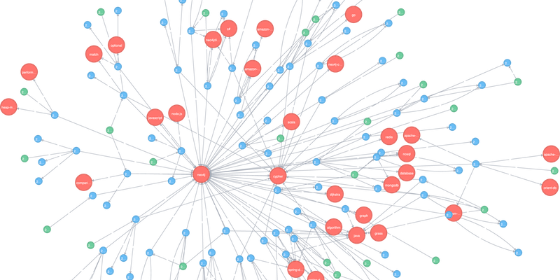

# Data Engineering Fundamentals
The rise of `ML` in recent years is tightly coupled with the rise of big data. Large data systems, even without ML, are complex.


## **Data Sources**
An ML system can work with data from many different sources. They have different
characteristics, can be used for different purposes, and require different processing
methods. Understanding the sources your data comes from can help you use your
data more efficiently. 

1 **`User input data source`:** data explicitly input by users. User input can be
text, images, videos, uploaded files, etc. In most cases, when we input data, we
expect to get results back immediately. Therefore, user input data tends to require fast
processing.

2 **`system-generated data source`:** This is the data generated by different
components of your systems, which include various types of logs and system outputs
such as model predictions. Logs can record the state and significant events of the system, such as memory usage, number of instances, services called, packages used, etc. They can record the results
of different jobs, including large batch jobs for data processing and model training.

Because debugging ML systems is hard, it’s a common practice to log everything you
can. This means that your volume of logs can grow very, very quickly. This leads to
two problems. The first is that it can be hard to know where to look because signals
are lost in the noise. There have been many services that process and analyze logs,
such as Logstash, Datadog, Logz.io, etc. Many of them use ML models to help you
process and make sense of your massive number of logs.

The system also generates data to record users’ behaviors, such as clicking, 
choosing a suggestion, scrolling, zooming, ignoring a pop-up, or spending an 
unusual amount of time on certain pages. Even though this is system-generated data, 
it’s still considered part of user data and might be subject to privacy regulations.


## **Data Formats**
Once you have data, you might want to store it (or “persist” it, in technical terms).
Since your data comes from multiple sources with different access patterns,6 storing
your data isn’t always straightforward and, for some cases, can be costly. It’s important
to think about how the data will be used in the future so that the format you use will
make sense.

Here are some of the questions you might want to consider:
- How do I store multimodal data, e.g., a sample that might contain both images
and texts?
- Where do I store my data so that it’s cheap and still fast to access?
- How do I store complex models so that they can be loaded and run correctly on different hardware?

The process of converting a data structure or object state into a format that can be
stored or transmitted and reconstructed later is `data serialization`.


1. **JSON** 
`JSON`, JavaScript Object Notation, is everywhere. Even though it was derived from
JavaScript, it’s language-independent—most modern programming languages can
generate and parse `JSON`.  It’s human-readable. Its key-value pair paradigm is simple
but powerful, capable of handling data of different levels of structuredness.

example of the json structured format
```json
{
"firstName": "Boatie",
"lastName": "McBoatFace",
"isVibing": true,
"age": 12,
"address": {
"streetAddress": "12 Ocean Drive",
"city": "Port Royal",
"postalCode": "10021-3100"
}
}
```

json unstructured blob of text format
```json
{
"text": "Boatie McBoatFace, aged 12, is vibing, at 12 Ocean Drive, Port Royal,
10021-3100"
}
```


2. **Row-Major Versus Column-Major Format**
The two formats that are common and represent two distinct paradigms are `CSV` and `Parquet`. `CSV` (comma-separated values) is row-major, which means consecutive elements in a row are stored next to each other in memory. `Parquet` is column-major, which means consecutive elements in a column are stored next to each other.

Because modern computers process sequential data more efficiently than nonsequen‐
tial data, if a table is row-major, accessing its rows will be faster than accessing its
columns in expectation. This means that for row-major formats, accessing data by
rows is expected to be faster than accessing data by columns.

Row-major formats allow faster data writes. Consider the situation when you have to
keep adding new individual examples to your data. For each individual example, it’d
be much faster to write it to a file where your data is already in a row-major format.

Overall, row-major formats are better when you have to do a lot of writes, whereas
column-major ones are better when you have to do a lot of column-based reads.


3. **Text Versus Binary Format**
`CSV` and `JSON` are text files, whereas `Parquet` files are binary files. Text files are
files that are in plain text, which usually means they are human-readable. Binary
files are the catchall that refers to all nontext files. As the name suggests, binary files
are typically files that contain only `0s` and `1s`, and are meant to be read or used by
programs that know how to interpret the raw bytes.

AWS recommends using the Parquet format because “the Parquet format is up to 2x
faster to unload and consumes up to 6x less storage in Amazon S3, compared to text
formats.


## **Data Models**
Data models describe how data is represented. How you choose to represent data not only affects the way your systems are built, but also the problems your systems can solve. 


1. **Relational Model**
Relational models are among the most persistent ideas in computer science. In this model, data is organ‐
ized into relations; each relation is a set of tuples. A table is an accepted visual representation of a relation, and each row of a table makes up a tuple. Data following the relational model is usually stored in file formats like CSV or Parquet.

It’s often desirable for relations to be normalized. Data normalization can follow normal forms such as the `first normal form (1NF)`, `second normal form (2NF)`, etc.

One major downside of normalization is that your data is now spread across multiple
relations. You can join the data from different relations back together, but joining can
be expensive for large tables.

Figuring out how to execute an arbitrary query is the hard part, which is the job
of query optimizers. A query optimizer examines all possible ways to execute a
query and finds the fastest way to do so.


    Query optimization is the process of improving the efficiency of database queries by refining them to reduce execution time, minimize resource consumption, and enhance overall system performance. This involves techniques like optimizing join operations, minimizing unnecessary data retrieval, and using resources more efficiently. 


**From Declarative Data Systems to Declarative ML Systems**'
With a declarative ML system, users only need to declare the features’ schema and the task, and the system will figure out the best model to perform that task with the given features. Users won’t have to write code
to construct, train, and tune models. Declarative ML systems today abstract away the
model development part, which is the hard part that lies in feature engineering, data processing, model evaluation, data shift detection, continual learning, and so on. 


2. **NoSQL** 
The latest movement against the relational data model is NoSQL. Two major types of nonrelational models are the `document model` and the `graph model`. The document model targets use cases where data comes in
self-contained documents and relationships between one document and another are rare. The graph model goes in the opposite direction, targeting use cases where relationships between data items are common and important.


**Document model**
The document model is built around the concept of “document.” A document is often
a single continuous string, encoded as `JSON`, `XML`, or a `binary` format like `BSON` (Binary JSON). All documents in a document database are assumed to be encoded in the same format. Each document has a unique key that represents that document, which can be used to retrieve it.


A collection of documents could be considered analogous to a table in a relational database, and a document analogous to a row. The application that reads the documents usually assumes some
kind of structure of the documents. Document databases just shift the responsibility
of assuming structures from the application that writes the data to the application
that reads the data.

`Example 3-1. Document 1: harry_potter.json`
```json
{
"Title": "Harry Potter",
"Author": "J .K. Rowling",
"Publisher": "Banana Press",
"Country": "UK",
"Sold as": [
{"Format": "Paperback", "Price": "$20"},
{"Format": "E-book", "Price": "$10"}
    ]
}
```


`Example 3-2. Document 2: sherlock_holmes.json`
```json
{
"Title": "Sherlock Holmes",
"Author": "Conan Doyle",
"Publisher": "Guava Press",
"Country": "US",
"Sold as": [
{"Format": "Paperback", "Price": "$30"},
{"Format": "E-book", "Price": "$15"}
    ]
}
```

`Example 3-3. Document 3: the_hobbit.json`
```json
{
"Title": "The Hobbit",
"Author": "J.R.R. Tolkien",
"Publisher": "Banana Press",
"Country": "UK",
"Sold as": [
{"Format": "Paperback", "Price": "$30"},
    ]
}
```

However, compared to the relational model, it’s harder and less efficient to execute
joins across documents compared to across tables.


**Graph model**
The graph model is built around the concept of a “graph.” A graph consists of nodes
and edges, where the edges represent the relationships between the nodes. A database
that uses graph structures to store its data is called a graph database. If in document
databases, the content of each document is the priority, then in graph databases, the
relationships between data items are the priority.

    A graph database is a specialized   database management system   that uses graph theory to store, represent, and query data, particularly data with complex relationships. Unlike relational databases that store data in tables, graph databases use  `nodes` and `edges` to represent entities and their relationships.

Because the relationships are modeled explicitly in graph models, it’s faster to retrieve
data based on relationships.





**Examples of Graph Databases:**

`Neo4j`: A popular graph database platform known for its speed and scalability. 

`Amazon Neptune`: A managed graph database service offered by Amazon Web Services. 

`Dgraph`: A distributed graph database that supports transactional operations. 


Many queries that are easy to do in one data model are harder to do in another data
model. Picking the right data model for your application can make your life so much
easier.


## **Structured Versus Unstructured Data**

`Structured Data`
Structured data follows a predefined data model, also known as a data schema. For
example, the data model might specify that each data item consists of two values: the
first value, `“name,”` is a string of at most `50` characters, and the second value, `“age,”` is an 8-bit integer in the range between 0 and 200. The predefined structure makes your data easier to analyze. If you want to know the average age of people in the database, all you have to do is to extract all the age values and average them out.


The disadvantage of structured data is that you have to commit your data to a predefined schema. If your schema changes, you’ll have to retrospectively update all your data, often causing mysterious bugs in the process.


`Unstructured Data`
Unstructured data doesn’t adhere to a predefined data schema. It’s usually text but can also be `numbers`,
`dates`, `images`, `audio`, etc. For example, a text file of logs generated by your ML model is unstructured data.

Even though unstructured data doesn’t adhere to a schema, it might still contain intrinsic patterns that help you extract structures. Unstructured data also allows for more flexible storage options.


A repository for storing structured data is called a `data warehouse`. A repository for storing unstructured data is called a `data lake`. 

- `Data lakes` are usually used to store raw data before processing. 
- `Data warehouses` are used to store data that has been processed into formats ready to be used.


| **Structured Data**                         | **Unstructured Data**                                                            |
| ------------------------------------------- | -------------------------------------------------------------------------------- |
| Schema clearly defined                      | Data doesn’t have to follow a schema                                             |
| Easy to search and analyze                  | Fast arrival                                                                     |
| Can only handle data with a specific schema | Can handle data from any source                                                  |
| Schema changes will cause a lot of troubles | No need to worry about schema changes (yet); the worry shifts to downstream apps |
| Stored in data warehouses                   | Stored in data lakes                                                             |


## **Data Storage Engines and Processing**

Data formats and data models specify the interface for how users can store and retrieve data. Storage engines, also known as `databases`, are the implementation of how data is stored and retrieved on machines. It’s useful to understand different types of databases as your team or your adjacent team might need to select a database appropriate for your application.

Typically, there are two types of workloads that databases are optimized for, `transactional processing` and `analytical processing`, and there’s a big difference between them.


**Transactional and Analytical Processing**

`Transactional Processing`

In DBMS, transaction processing ensures `data integrity` by treating a series of operations as a single unit of work, guaranteeing that all operations either complete successfully or are rolled back to their previous state. This ensures that even if a failure occurs, the database remains `consistent`. 

The transactions are inserted as they are generated, and occasionally updated when something changes, or
deleted when they are no longer needed. This type of processing is known as online `transaction processing (OLTP)`.


Because these transactions often involve users, they need to be processed fast `(low latency)` so that they don’t keep users waiting. The processing method needs to have `high availability` that is, the processing system needs to be available any time a user wants to make a transaction. If your system can’t process a transaction, that transaction won’t go through.


Transactional databases are designed to process online transactions and satisfy the `low latency`, `high availability` requirements. When people hear transactional databases, they usually think of `ACID` (atomicity, consistency, isolation, durability).


- Atomicity: A transaction is treated as a single, indivisible unit of work. Either all its operations are completed, or none are.  If any step in the transaction fails, all other steps must fail also.

- Consistency: Transactions transform the database from one consistent state to another. They maintain the database's integrity by ensuring that data adheres to predefined rules. For example, a transaction must be made by a valid user.

- Isolation: Transactions are independent of each other. Each transaction's operations are not visible to other transactions until the transaction is committed. Two users accessing the same data won’t change it at the same time. For example, you don’t want two users to book the same driver at the same time.

- Durability: To guarantee that once a transaction has been committed, it will remain committed even in the case of a system failure.


`Analytical Processing`

Analytical processing, often referred to as `Online Analytical Processing (OLAP)`, is a method for analyzing large datasets, especially in the context of `business intelligence` and `data warehousing`. It focuses on querying and reporting, unlike `Online Transaction Processing (OLTP)` which handles daily transactions. `OLAP` systems are designed for `complex queries` and `multidimensional analysis`, enabling users to explore data from various perspectives and identify patterns. 

- Multidimensional Analysis
- Data Warehousing
- Complex Queries
- Real-time Analysis

**Benefits**
- Data Analysis and Insights
- Decision Making
- Business Intelligence


Today, we have transactional databases that can handle analytical queries, 
such as **CockroachDB**. We also have analytical databases that can handle 
transactional queries, such as **Apache Iceberg** and **DuckDB**.


In the data world;
- `online` processing means data is immediately available for input/output.
- `Nearline`, which is short for near-online, means data is not immediately available but can be made online quickly without human intervention.
- `Offline` means data is not immediately available and requires some human intervention to become online.


## **ETL: Extract, Transform, and Load**


