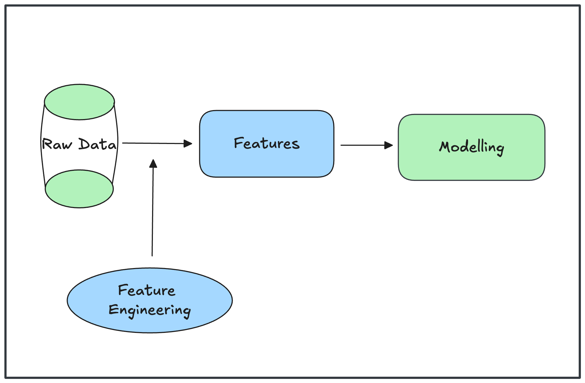

# Feature Engineering
Because the success of today’s ML systems still depends on their features, it’s important for organizations interested in using ML in production to invest time and effort into feature engineering. How to engineer good features is a complex question with no foolproof answers. The best way to learn is through experience: trying out different features and observing how they affect your models’ performance.

Feature engineering often involves subject matter expertise, and subject matter experts might not always be engineers, so it’s important to design your workflow in a way that allows nonengineers to contribute to the process.

**Here is a summary of best practices for feature engineering:**

- Split data by time into `train/valid/test` splits instead of doing it randomly.

- If you oversample your data, do it after splitting.

- Scale and normalize your data after splitting to avoid data leakage.

- Use statistics from only the `train split`, instead of the entire data, to scale your features and handle missing values.

- Understand how your data is generated, collected, and processed. Involve domain experts if possible.

- Keep track of your data’s lineage.

- Understand `feature importance` to your model.

- Use features that `generalize well`.

- Remove no longer useful features from your models.

In most real-world ML projects, the process of collecting data and feature engineering goes on as long as your models are in production. We need to use new, incoming data to continually improve models. State-of-the-art model architectures can still perform poorly of they don't use a good set of features. 

## **Learned Features Versus Engineered Features**

The process of choosing what information to use and how to extract this information into a format usable by your ML models is `feature engineering`. For complex tasks such as recommending videos for users to watch next on TikTok, the number of features used can go up to millions. For domain-specific tasks such as predicting whether a transaction is fraudulent, you might need subject matter expertise with banking and frauds to be able to come up with useful features.

## **Common Feature Engineering Operations**

Because of the importance and the ubiquity of feature engineering in ML projects, there have been many techniques developed to streamline the process.

1. **Handling Missing Values**

One of the first things you might notice when dealing with data in production is that some values are missing.

Three type of missing values;
- `Missing not at random (MNAR)`
- `Missing at random (MAR)`
- `Missing completely at random (MCAR)`

**Approaches to handling missing values:**

a. **Deletion** : 

- One way to delete is `column deletion`: if a variable has too many missing values, just remove that variable. if the missing values in a column are well over `50%`, you might be tempted to remove the variable from your model. The drawback of this approach is that you might remove important information and reduce the accuracy of your model.

- Another way to delete is `row deletion`: if a sample has missing value(s), just remove that sample. This method can work when the missing values are completely at random `(MCAR)` and the number of examples with missing values is small, such as less than `0.1%`. You don’t want to do `row deletion` if that means `10%` of your data samples are removed.

However, removing rows of data can also remove important information that your model needs to make predictions, especially if the missing values are not at random (MNAR). On top of that, removing rows of data can create `biases` in your model, especially if the missing values are at random (MAR).

b. **Imputation**

Even though deletion is tempting because it’s easy to do, deleting data can lead to losing important information and introduce biases into your model. If you don’t want to delete missing values, you will have to impute them, which means `“fill them with certain values.”` Deciding which `“certain values”` to use is the hard part.

One common practice is to fill in missing values with their defaults. For example, if the job is missing, you might fill it with an empty string `“ ”`. Another common practice is to fill in missing values with the `mean`, `median`, or `mode` (the most common value). For example, if the temperature value is missing for a data sample whose month value is July, it’s not a bad idea to fill it with the median temperature of July.

In general, you want to avoid filling missing values with possible values, such as filling the missing number of children with 0—0 is a possible value for the number of children. It makes it hard to distinguish between people whose information is missing and people who don’t have children.

Multiple techniques might be used at the same time or in sequence to handle missing values for a particular set of data. Regardless of what techniques you use, one thing is certain: there is no perfect way to handle missing values. With deletion, you risk losing important information or accentuating biases. With imputation, you risk injecting your own bias into and adding noise to your data, or worse, data leakage.

2. **Scaling**

Before inputting features into models, it’s important to scale them to be similar ranges. This process is called `feature scaling`. This is one of the simplest things you can do that often results in a performance boost for your model. Neglecting to do so can cause your model to make `gibberish predictions`, especially with `classical algorithms` like `gradient-boosted trees` and `logistic regression`.

An intuitive way to scale your features is to get them to be in the range `[0, 1]`. Given a variable `x`, its values can be rescaled to be in this range using the following formula:

- $`x' = \frac{x - \min(x)}{\max(x) - \min(x)}`$

You can validate that if `x` is the maximum value, the scaled value $x'$ will be `1`. If `x` is the minimum value, the scaled value $x'$ will be `0`.

If you want your feature to be in an arbitrary range `[a, b]`—empirically, I find the range `[–1, 1]` to work better than the range `[0, 1]`.

To rescale a variable $( x )$ to a custom range $([a, b])$, such as $([-1, 1])$, use the formula:

- $`x' = a + \frac{(x - \min(x))(b - a)}{\max(x) - \min(x)}`$

Scaling to an arbitrary range works well when you don’t want to make any assumptions about your variables. If you think that your variables might follow a normal distribution, it might be helpful to normalize them so that they have `zero mean` and `unit variance`. This process is called `standardization`:

- $`x' = \frac{x - \mu}{\sigma}`$

where 
- $( \mu )$ is the `mean` of the variable \( x \), and 

- $( \sigma )$ is the standard deviation.

In practice, `ML models` tend to struggle with features that follow a `skewed distribution`. To help mitigate the skewness, a technique commonly used is `log transformation`: apply the log function to your feature. While this technique can yield performance gain in many cases, it doesn’t work for all cases, and you should be wary of the analysis performed on log-transformed data instead of the original data.

There are two important things to note about scaling. One is that it’s a common source of `data leakage`. Another is that it often requires `global statistics` you have to look at the entire or a subset of training data to calculate its `min`, `max`, or `mean`. During `inference`, you reuse the statistics you had obtained during training to scale new data. If the new data has changed significantly compared to the training, these
statistics won’t be very useful. Therefore, it’s important to retrain your model often to account for these changes.

3. **Discretization**

Discretization is the process of turning a `continuous feature` into a `discrete feature`. This process is also known as `quantization` or `binning`. This is done by creating buckets for the given values. 

Even though, by definition, `discretization` is meant for `continuous features`, it can be used for `discrete features` too. The `age variable` is `discrete`, but it might still be useful to group the values into buckets such as follows:

• Less than 18

• Between 18 and 22

• Between 22 and 30

• Between 30 and 40

• Between 40 and 65

• Over 65

4. **Encoding categorical features**

People who haven’t worked with data in production tend to assume that categories are `static`, which means the categories don’t change over time. This is true for many categories. For example, `age brackets` and `income brackets` are unlikely to change, and you know exactly how many categories there are in advance. Handling these categories is straightforward. You can just give each category a `number` and you’re done.

5. **Feature Crossing**

Feature crossing is the technique to combine two or more features to generate `new features`. This technique is useful to model the `nonlinear relationships` between features. 

Because feature crossing helps model `nonlinear relationships` between variables, it’s essential for models that can’t learn or are bad at learning `nonlinear relationships`, such as `linear regression`, `logistic regression`, and `tree-based models`. It’s less important in `neural networks`, but it can still be useful because explicit feature crossing occasionally helps neural networks learn `nonlinear relationships` faster. 

- A caveat of feature crossing is that it can make your feature space blow up. 
- Another caveat is that because feature crossing increases the number of features models use, it can make models overfit to the training data.

6. **Discrete and Continuous Positional Embeddings**

An embedding is a vector that represents a piece of data. Embedding refers to a process of representing data points (like `words`, `images`, or `user preferences`) as `numerical vectors` in a `lower-dimensional` space.

We call the set of all possible embeddings generated by the same algorithm for a type of data `“an embedding space.”` All embedding vectors in the same space are of the same size. One of the most common uses of embeddings is `word embeddings`, where you can represent each word with a vector.

If we use a `recurrent neural network`, it will process words in `sequential order`, which means the order of words is `implicitly inputted`. However, if we use a model like a `transformer`, words are processed in parallel, so words’ positions need to be explicitly inputted so that our model knows the order of these words `(“a dog bites a child” is very different from “a child bites a dog”)`. 

## **Data Leakage**

`Data leakage` (or leakage) happens when your `training data` contains information about the `target`, but similar data will not be available when the model is used for `prediction`. This leads to `high performance` on the `training set` (and possibly even the `validation data`), but the model will perform poorly in `production`.

In other words, leakage causes a model to look accurate until you start making decisions with the model, and then the model becomes very inaccurate. Data leakage is challenging because often the leakage is nonobvious. It’s dangerous because it can cause your models to fail in an unexpected and spectacular way, even
after extensive `evaluation` and `testing`.

An example to demonstrate what data leakage is:

`Suppose you want to build an ML model to predict whether a `CT scan` of a lung shows signs of cancer. You obtained the data from `hospital A`, removed the `doctors’ diagnosis` from the data, and trained your model. It did really well on the test data from `hospital A`, but poorly on the data from `hospital B`.`

`After extensive investigation, you learned that at `hospital A`, when doctors think that a patient has lung cancer, they send that patient to a more advanced scan machine, which outputs slightly different `CT scan` images. Your model learned to rely on the information on the scan machine used to make predictions on whether a scan image shows signs of lung cancer. `Hospital B` sends the patients to different `CT scan` machines at random, so your model has no information to rely on. We say that labels are leaked into the features during training.`
`

### **Common Causes for Data Leakage**
Some common causes of data leakage and how to avoid them.

a. **Splitting time-correlated data randomly instead of by time**

When I learned ML in college, I was taught to randomly split my data into train, validation, and test splits. This is also how data is often reportedly split in `ML research papers`. However, this is also one common cause for data leakage.

`In many cases, data is `time-correlated`, which means that the time the data is generated affects its label distribution. Sometimes, the `correlation` is obvious, as in the case of stock prices. To oversimplify it, the prices of similar stocks tend to move together. If `90%` of the tech stocks go down today, it’s very likely the other `10%` of the tech stocks go down too. When building models to predict the `future stock prices`, you
want to split your `training data by time`, such as `training your model` on data from the `first six days` and evaluating it on `data` from the `seventh` day. If you randomly split your data, prices from the `seventh day` will be included in your `train split` and leak into your model the condition of the market on that day. We say that the `information` from the `future` is leaked into the `training process`.`

To prevent future information from leaking into the training process and allowing models to cheat during evaluation, split your data by `time`, instead of splitting randomly, whenever possible. For example, if you have data from `five weeks`, use the first `four weeks` for the `train split`, then randomly split `week 5` into `validation` and `test splits`.

b. **Scaling before splitting**

Scaling requires global statistics—e.g., `mean`, `variance`—of your data. One common mistake is to use the entire training data to generate global statistics before splitting it into different splits, leaking the mean and variance of the test samples into the training process, allowing a model to adjust its predictions for the test samples. This information isn’t available in production, so the model’s performance will likely
degrade.

To avoid this type of `leakage`, always split your data first before scaling, then use the `statistics` from the `train split` to scale all the splits. Some even suggest that we split our data before any exploratory data analysis and data processing, so that we don’t accidentally gain information about the test split.

c. **Filling in missing data with statistics from the test split**

One common way to handle the missing values of a feature is to fill (input) them with the `mean` or `median` of all values present. Leakage might occur if the `mean` or `median` is calculated using entire data instead of just the train split. This type of leakage is similar to the type of leakage caused by scaling, and it can be prevented by using only statistics from the train split to fill in missing values in all the splits.

d. **Poor handling of data duplication before splitting**

If you have duplicates or near-duplicates in your data, failing to remove them before splitting your data might cause the same samples to appear in both train and validation/test splits. Data duplication is quite common in the industry, and has also been found in popular research datasets. 

To avoid this, always check for duplicates before splitting and also after splitting just to make sure. If you oversample your data, do it after splitting.

d. **Group leakage**

A group of examples have strongly correlated labels but are divided into different splits. For example, a patient might have two lung CT scans that are a week apart, which likely have the same labels on whether they contain signs of lung cancer, but one of them is in the train split and the second is in the test split. This type of leakage is common for `objective detection` tasks that contain photos of the same object taken
milliseconds apart—some of them landed in the train split while others landed in the test split. It’s hard avoiding this type of data leakage without understanding how your data was generated.

e. **Leakage from data generation process**

The example earlier about how information on whether a `CT scan` shows signs of lung cancer is leaked via the scan machine is an example of this type of leakage. Detecting this type of data leakage requires a deep understanding of the way data is collected. For example, it would be very hard to figure out that the model’s poor performance in 1hospital B1 is due to its different scan machine procedure if you don’t know about different scan machines or that the procedures at the two hospitals are different.

There’s no foolproof way to avoid this type of leakage, but you can mitigate the risk by keeping track of the sources of your data and understanding how it is collected and processed. Normalize your data so that data from different sources can have the same `means` and `variances`. If different `CT scan` machines output images with different resolutions, normalizing all the images to have the same resolution would make it harder for models to know which image is from which scan machine. And don’t forget to incorporate subject matter experts, who might have more contexts on how data is collected and used, into the `ML design` process!

### **Detecting Data Leakage**

Data leakage can happen during many steps, from generating, collecting, sampling, splitting, and processing data to feature engineering. It’s important to monitor for data leakage during the entire lifecycle of an ML project.

Measure the predictive power of each feature or a set of features with respect to the target variable (label). If a feature has unusually high correlation, investigate how this feature is generated and whether the correlation makes sense. It’s possible that two features independently don’t contain leakage, but two features together can contain leakage. For example, when building a model to predict how long an employee will stay at a company, the starting date and the end date separately doesn’t tell us much about their tenure, but both together can give us that information.

Do `ablation studies` to measure how important a feature or a set of features is to your model. If removing a feature causes the model’s performance to deteriorate significantly, investigate why that feature is so important. If you have a massive amount of features, say a thousand features, it might be infeasible to do ablation studies on every possible combination of them, but it can still be useful to occasionally do ablation studies with a subset of features that you suspect the most.

``
Ablation studies, in the context of artificial intelligence and machine learning, are systematic experiments designed to assess the impact of individual components within a complex model. By removing or altering specific parts of a model and observing the resulting change in performance, researchers can identify which components are essential for achieving the desired outcome and which may be redundant. This process helps in understanding the model's inner workings, validating its architecture, and guiding further refinement. 
``

Keep an eye out for new features added to your model. If adding a new feature significantly improves your model’s performance, either that feature is really good or that feature just contains leaked information about labels.

 ### **Engineering Good Features**

Generally, adding more features leads to better model performance. In my experience, the list of features used for a model in production only grows over time. However, more features doesn’t always mean better model performance. Having too many features can be bad both during training and serving your model for the
following reasons:

- The more features you have, the more opportunities there are for data leakage.

- Too many features can cause overfitting.

- Too many features can increase memory required to serve a model, which, in turn, might require you to use a more expensive machine/instance to serve your model.

- Too many features can increase inference latency when doing online prediction, especially if you need to extract these features from raw data for predictions online.

- Useless features become technical debts. Whenever your data pipeline changes, all the affected features need to be adjusted accordingly.

In theory, if a feature doesn’t help a model make good predictions, regularization techniques like `L1 regularization` should reduce that feature’s weight to `0`. However, in practice, it might help models learn faster if the features that are no longer useful (and even possibly harmful) are removed, prioritizing good features.

There are two factors you might want to consider when evaluating whether a feature is good for a model: `importance` to the model and `generalization` to unseen data.

### **Feature Importance**

There are many different methods for measuring a feature’s importance. If you use a classical ML algorithm like `boosted gradient trees`, the easiest way to measure the importance of your features is to use built-in feature importance functions implemented by `XGBoost`.

Often, a small number of features accounts for a large portion of your model’s feature importance. When measuring feature importance for a click-through rate prediction model, the `ads` team at Facebook found out that the top `10 features` are responsible for about half of the model’s total feature importance, whereas the last `300 features` contribute less than 1% feature importance

Not only good for choosing the right features, feature importance techniques are also great for interpretability as they help you understand how your models work under the hood.

### **Feature Generalization**

Since the goal of an ML model is to make correct predictions on unseen data, features used for the model should generalize to unseen data. Not all features generalize equally.

Measuring `feature generalization` is a lot less scientific than measuring feature importance, and it requires both `intuition` and `subject matter` expertise on top of statistical knowledge. Overall, there are two aspects you might want to consider with regards to generalization: `feature coverage` and `distribution of feature values`.

## Summary

Because the success of today’s ML systems still depends on their features, it’s important for organizations interested in using ML in production to invest time and effort into feature engineering.

How to engineer good features is a complex question with no foolproof answers. The best way to learn is through experience: trying out different features and observing how they affect your models’ performance. 

Feature engineering often involves subject matter expertise, and subject matter experts might not always be engineers, so it’s important to design your workflow in a way that allows nonengineers to contribute to the process.

