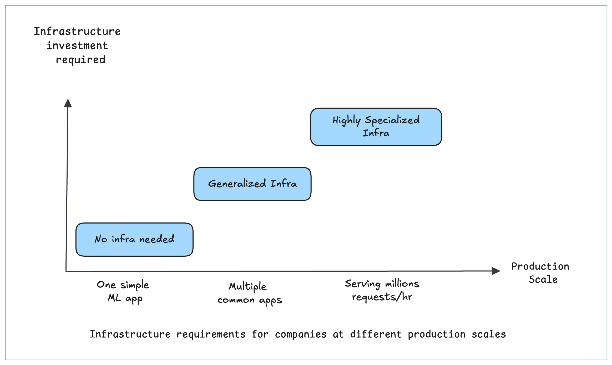
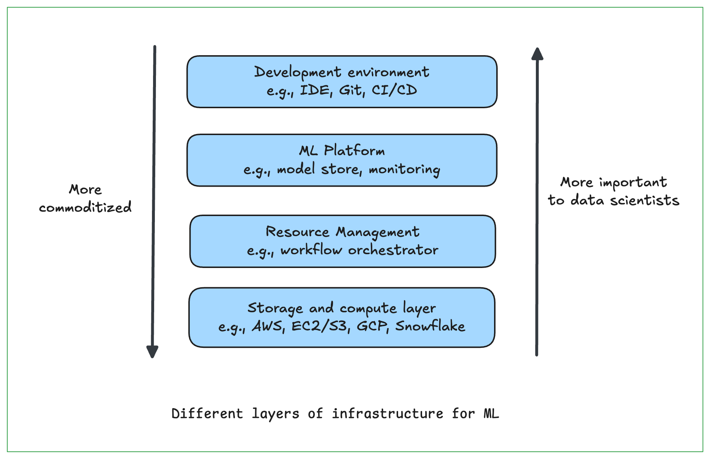
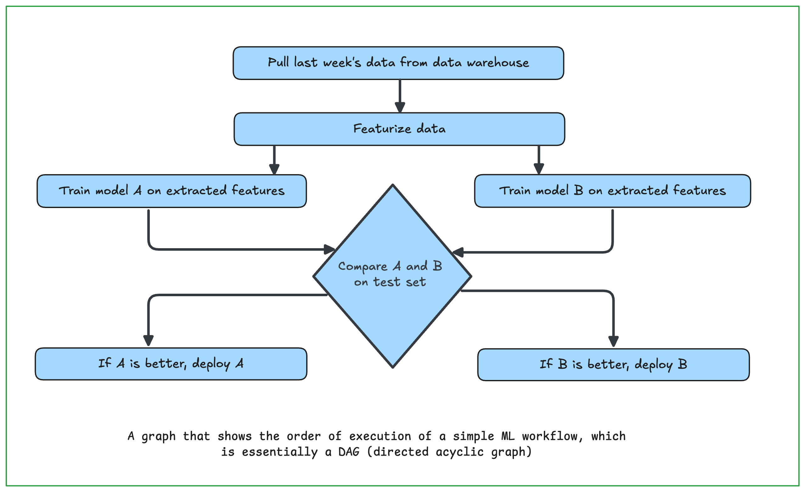
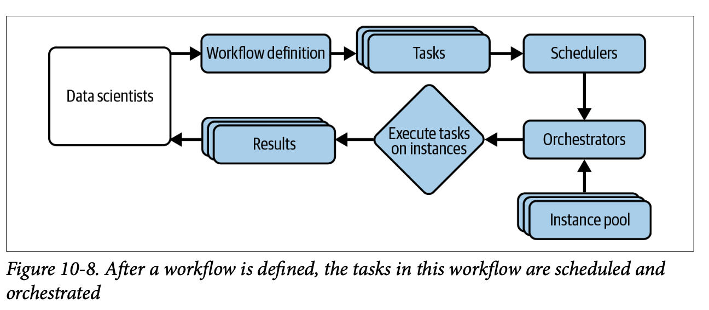

# Infrastructure and Tooling for MLOps

ML systems are complex. The more complex a system, the more it can benefit from good infrastructure. Infrastructure, when set up right, can help automate processes, reducing the need for specialized knowledge and engineering time. This, in turn, can speed up the development and delivery of ML applications, reduce the surface area for bugs, and enable new use cases. When set up wrong, however, infrastructure is painful to use and expensive to replace. 

**What is Infrastructure?**

ML infrastructure is the power grid, the plumbing, and the scaffolding behind every AI system.

In the ML world, infrastructure is the set of fundamental facilities that support the development and maintenance of ML systems. What should be considered the “fundamental facilities” varies greatly from company to company.

## **Four Layers of ML infrastructure**

**Storage and compute**

The storage layer is where data is collected and stored. The compute layer provides the compute needed to run your ML workloads such as training a model, computing features, generating features, etc.

**Resource management**

Resource management comprises tools to schedule and orchestrate your workloads to make the most out of your available compute resources. Examples of
tools in this category include `Airflow`, `Kubeflow`, and `Metaflow`.

**ML platform**

This provides tools to aid the development of ML applications such as model stores, feature stores, and monitoring tools. Examples of tools in this category include `SageMaker` and `MLflow`.

**Development environment**

This is usually referred to as the dev environment; it is where code is written and experiments are run. Code needs to be versioned and tested. Experiments need to be tracked.

Data and compute are the essential resources needed for any ML project, and thus the storage and compute layer forms the infrastructural foundation for any company that wants to apply ML.

### Storage and Compute

The storage layer is where data is collected and stored. At its simplest form, the storage layer can be a `hard drive disk (HDD)` or a `solid state disk (SSD)`. The storage layer can be in one place, e.g., you might have all your data in `Amazon S3` or in `Snowflake`, or spread out over multiple locations. Your storage layer can be `on-prem` in a `private data center` or on the cloud. 

The compute layer refers to all the compute resources a company has access to and the mechanism to determine how these resources can be used. The amount of compute resources available determines the scalability of your workloads. You can think of the compute layer as the engine to execute your jobs. At its simplest form, the compute layer can just be a `single CPU core` or a `GPU core` that does all your computation.
Its most common form is cloud compute managed by a cloud provider such as `AWS Elastic Compute Cloud (EC2)` or `GCP`.

However, the compute layer doesn’t always use threads or cores as compute units. There are compute layers that abstract away the notions of cores and use other units of computation. For example, computation engines like `Spark` and `Ray` use “job” as their unit, and Kubernetes uses “pod,” a wrapper around containers, as its smallest deployable unit. While you can have multiple containers in a pod, you can’t independently start or stop different containers in the same pod.

To execute a job, you first need to load the required data into your compute unit’s memory, then execute the required operations—addition, multiplication, division, convolution, etc.—on that data. For example, to add two arrays, you will first need to load these two arrays into memory, and then perform addition on the two arrays. If the compute unit doesn’t have enough memory to load these two arrays, the operation will be impossible without an algorithm to handle out-of-memory computation. Therefore, a compute unit is mainly characterized by two metrics: 
- how much memory it has and 
- how fast it runs an operation.

Like data storage, the compute layer is largely commoditized. This means that instead of setting up their own data centers for storage and compute, companies can pay cloud providers like `AWS` and `Azure` for the exact amount of compute they use. Cloud compute makes it extremely easy for companies to start building without having to worry about the compute layer. 

### Development Environment

The dev environment is where ML engineers write code, run experiments, and interact with the production environment where champion models are deployed and challenger models evaluated. The dev environment consists of the following components: `IDE (integrated development environment)`, `versioning`, and `CI/CD`.

**Dev Environment Setup**

The dev environment should be set up to contain all the tools that can make it easier for engineers to do their job. It should also consist of tools for `versioning`.

Companies use an `ad hoc` set of tools to version their `ML workflows`, such as `Git` to version control code, `DVC` to version data, `Weights & Biases` or `Comet.ml` to track experiments during development, and `MLflow` to track artifacts of models when deploying them. `Claypot AI` is working on a platform that can help you version and track all your ML workflows in one place. Versioning is important for any software engineering projects, but even more so for ML projects because of both the sheer number of things you can change `(code, parameters, the data itself, etc.)` and the need to keep track of prior runs to reproduce later on. 

The dev environment should also be set up with a `CI/CD` test suite to test your code before pushing it to the `staging` or `production` environment. Examples of tools to orchestrate your `CI/CD` test suite are `GitHub Actions` and `CircleCI`.

**IDE**

The IDE is the editor where you write your code. IDEs tend to support multiple programming languages. IDEs can be native apps like VS Code or Vim. IDEs can be browser-based, which means they run in browsers, such as AWS Cloud9.

Many data scientists write code not just in IDEs but also in notebooks like Jupyter Notebooks and Google Colab.Notebooks are more than just places to write code. You can include arbitrary artifacts such as images, plots, data in nice tabular formats, etc., which makes notebooks very useful for exploratory data analysis and analyzing model training results.

Notebooks have a nice property: they are stateful—they can retain states after runs. If your program fails halfway through, you can rerun from the failed step instead of having to run the program from the beginning. This is especially helpful when you have to deal with large datasets that might take a long time to load. With notebooks, you only need to load your data once—notebooks can retain this data in memory—instead of having to load it each time you want to run your code.

Because notebooks are so useful for data exploration and experiments, notebooks have become an indispensable tool for data scientists and ML. Some companies have made notebooks the center of their data science infrastructure.

**From Dev to Prod: Containers**

During development, you might usually work with a fixed number of machines or instances (usually one) because your workloads don’t fluctuate a lot—your model doesn’t suddenly change from serving only 1,000 requests an hour to 1 million requests an hour.

A production service, on the other hand, might be spread out on multiple instances. The number of instances changes from time to time depending on the incoming workloads, which can be unpredictable at times. For example, a celebrity tweets about your fledgling app and suddenly your traffic spikes `10x`. You will have to turn on new instances as needed, and these instances will need to be set up with required tools and
packages to execute your workloads.

A question arises: how do you re-create an environment on any new instance? Container technology—of which `Docker` is the most popular—is designed to answer this question. With Docker, you create a Dockerfile with step-by-step instructions on how to re-create an environment in which your model can run: 

- `install this package`, 
- `download this pretrained model`, 
- `set environment variables`, 
- `navigate into a folder`, etc.

These instructions allow hardware anywhere to run your code.

Two key concepts in Docker are `image` and `container`. Running all the instructions in a `Dockerfile` gives you a Docker image. If you run this Docker image, you get back a Docker container. You can think of a Dockerfile as the recipe to construct a mold, which is a `Docker image`. From this mold, you can create multiple running instances; each is a `Docker container`.

You can build a Docker image either from scratch or from another Docker image. For example, NVIDIA might provide a Docker image that contains TensorFlow and all necessary libraries to optimize TensorFlow for GPUs. If you want to build an application that runs TensorFlow on GPUs, it’s not a bad idea to use this Docker
image as your base and install dependencies specific to your application on top of this base image.

A container registry is where you can share a `Docker image` or find an `image` created by other people to be shared publicly or only with people inside their organizations. Common container registries include `Docker Hub` and `AWS ECR (Elastic Container Registry)`.

If your application does anything interesting, you will probably need more than one container. Different containers might also be necessary when different steps in your pipeline have conflicting dependencies, such as your featurizer code requires `NumPy 0.8` but your model requires `NumPy 1.0`.

If you have `100 microservices` and each microservice requires its own container, you might have `100 containers` running at the same time. Manually building, running, allocating resources for, and stopping `100 containers` might be a painful chore. A tool to help you manage multiple containers is called `container orchestration`. `Docker Compose` is a lightweight container orchestrator that can manage containers on a
single host.

However, each of your containers might run on its own host, and this is where Docker Compose is at its limits. `Kubernetes (K8s)` is a tool for exactly that. `K8s` creates a network for containers to communicate and share resources. It can help you spin up containers on more instances when you need more `compute/memory` as well as shutting down containers when you no longer need them, and it helps maintain high availability for your system.

### Resource Management

In the cloud world where storage and compute resources are much more elastic, the concern has shifted from how to maximize resource utilization to how to use resources cost-effectively. Adding more resources to an application doesn’t mean decreasing resources for other applications, which significantly simplifies the allocation challenge. Many companies are OK with adding more resources to an application as long as the added cost is justified by the return, e.g., extra revenue or saved engineering time.

In the vast majority of the world, where engineers’ time is more valuable than compute time, companies are OK using more resources if this means it can help their engineers become more productive. This means that it might make sense for companies to invest in automating their workloads, which might make using resources less efficient than manually planning their workloads, but free their engineers to focus on work with higher returns. Often, if a problem can be solved by either using more non-human resources (e.g., throwing more compute at it) or using more human resources (e.g., requiring more engineering time to redesign), the first solution might be preferred.

**Cron, Schedulers, and Orchestrators**

There are two key characteristics of ML workflows that influence their resource management: repetitiveness and dependencies.

ML workloads are rarely one-time operations but something repetitive. For example, you might train a model every week or generate a new batch
of predictions every four hours. These repetitive processes can be scheduled and orchestrated to run smoothly and cost-effectively using available resources.

Scheduling repetitive jobs to run at fixed times is exactly what `cron` does. This is also all that `cron` does: run a script at a predetermined time and tell you whether the job succeeds or fails. It doesn’t care about the dependencies between the jobs it runs—you can run `job A` after `job B` with cron but you can’t schedule anything complicated like `run B` if `A` succeeds and `run C` if `A` fails.

This leads us to the second characteristic: `dependencies`. Steps in an `ML workflow` might have complex dependency relationships with each other. For example, an `ML workflow` might consist of the following steps:

1. Pull last week’s data from `data warehouses`.

2. Extract features from this pulled data.

3. Train two models, `A` and `B`, on the extracted features.

4. Compare `A` and `B` on the test set.

5. Deploy `A` if `A` is better; otherwise deploy `B`.

`DAG: directed acyclic graph`. It has to be directed to express the dependencies among steps. It can’t contain cycles because, if it does, the job will just keep on running forever. DAG is a common way to represent computing workflows in general, not just ML workflows. Most workflow management tools require you to specify your workflows in a form of `DAGs`.

`Schedulers` are cron programs that can handle dependencies. It takes in the DAG of a workflow and schedules each step accordingly. You can even schedule to start a `job` based on an `event-based trigger`, e.g., start a job whenever an event X happens. `Schedulers` also allow you to specify what to do if a job fails or succeeds, e.g., if it fails, how many times to retry before giving up.

Schedulers tend to leverage queues to keep track of jobs. Jobs can be queued, prioritized, and allocated resources needed to execute. This means that schedulers need to be aware of the resources available and the resources needed to run each job—the resources needed are either specified as options when you schedule a job or estimated by the scheduler. For instance, if a job requires `8 GB` of memory and `two CPUs`, the scheduler needs to find among the resources it manages an instance with `8 GB` of memory and `two CPUs` and wait until the instance is not executing other jobs to run this job on the instance.

If schedulers are concerned with when to run jobs and what resources are needed to run those jobs, orchestrators are concerned with where to get those resources. Schedulers deal with job-type abstractions such as `DAGs`, `priority queues`, `user-level quotas` (i.e., the maximum number of instances a user can use at a given time), etc.

Orchestrators deal with `lower-level` abstractions like `machines`, `instances`, `clusters`, `service-level grouping`, `replication`, etc. If the orchestrator notices that there are more jobs than the pool of available instances, it can increase the number of instances in the available instance pool. We say that it `“provisions”` more computers to handle the workload. Schedulers are often used for periodical jobs, whereas orchestrators
are often used for services where you have a long-running server that responds to requests.

The most well-known container orchestrator today is undoubtedly `Kubernetes`. `K8s` can be used on-prem (even on your laptop via minikube).

Many people use schedulers and orchestrators interchangeably because schedulers usually run on top of orchestrators. Schedulers like Slurm and Google’s Borg have some orchestrating capacity, and orchestrators like `HashiCorp Nomad` and `K8s` come with some scheduling capacity. But you can have separate schedulers and
orchestrators, such as running `Spark’s job scheduler` on top of Kubernetes or `AWS Batch scheduler` on top of EKS. Orchestrators such as HashiCorp Nomad and data science–specific orchestrators including `Airflow`, `Argo`, `Prefect`, and `Dagster` have their own schedulers.

**Data Science Workflow Management**

We’ve discussed the differences between schedulers and orchestrators and how they can be used to execute workflows in general. Readers familiar with workflow management tools aimed especially at data science like `Airflow`, `Argo`, `Prefect`, `Kubeflow`, `Metaflow`, etc. might wonder where they fit in this scheduler versus orchestrator discussion. 

In its simplest form, workflow management tools manage workflows. They generally allow you to specify your workflows as DAGs. A workflow might consist of a 

- `featurizing step`, 

- `a model training step`, and 

- `an evaluation step`. 

Workflows can be defined using either code `(Python)` or configuration files `(YAML)`. Each step in a workflow is called a `task`. 

Almost all workflow management tools come with some `schedulers`, and therefore, you can think of them as schedulers that, instead of focusing on individual jobs, focus on the workflow as a whole. Once a workflow is defined, the underlying scheduler usually works with an orchestrator to allocate resources to run the workflow.

Five most common data science workflow management tools;

- `Airflow:` Airflow is one of the earliest workflow orchestrators. It’s an amazing task scheduler that comes with a huge library of operators that makes it easy to use Airflow with different cloud providers, databases, storage options, and so on.

**Drawbacks:**

- *Airflow is monolithic, which means it packages the entire workflow into one container.*

- *Airflow’s DAGs are not parameterized, which means you can’t pass parameters into your workflows.*

- *Airflow’s DAGs are static, which means it can’t automatically create new steps at runtime as needed.*

- `Argo:` 

Argo addresses the container problem. Every step in an Argo workflow is run in its own container. However, Argo’s workflows are defined in `YAML`, which allows you to define each step and its requirements in the same file.

The main drawback of Argo, other than its messy YAML files, is that it can only run on `K8s clusters`, which are only available in production. If you want to test the same workflow locally, you’ll have to use `minikube` to simulate a `K8s` on your laptop, which can get messy.

- `Prefect`: 

Prefect’s workflows are parameterized and dynamic, a vast improvement compared to Airflow. It also follows the `“configuration as code”` principle so workflows are defined in Python.

You can run each step in a container, but you’ll still have to deal with Dockerfiles and register your docker with your workflows in Prefect.

- `Kubeflow:`

Kubeflow and Metaflow, the two tools that aim to help you run the workflow in both `dev` and `prod` environments by abstracting away infrastructure boilerplate code usually needed to run `Airflow` or `Argo`.

One component of Kubeflow is `Kubeflow Pipelines`, which is built on top of `Argo`, and it’s meant to be used on top of `K8s`.

In Kubeflow, while you can define your workflow in Python, you still have to write a `Dockerfile` and a `YAML` file to specify the specs of each component (e.g., `process data`, `train`, `deploy`) before you can stitch them together in a Python workflow. Basically, Kubeflow helps you abstract away other tools’ boilerplate by
making you write Kubeflow boilerplate.

- `Metaflow:`

Metaflow can be used with AWS Batch or K8s. In Metaflow, you can use a Python decorator `@conda` to specify the requirements for each step—required libraries, memory and compute requirements—and Metaflow will automatically create a container with all these requirements to execute the step. You save on Dockerfiles or YAML files.

Metaflow allows you to work seamlessly with both `dev` and `prod` environments from the same notebook/script. You can run experiments with small datasets on local machines, and when you’re ready to run with the large dataset on the cloud, simply add `@batch decorator` to execute it on `AWS Batch`. You can even run different steps in the same workflow in different environments.

## ML Platform

As each company finds uses
for ML in more and more applications, there’s more to be gained by leveraging the
same set of tools for multiple applications instead of supporting a separate set of tools
for each application. This shared set of tools for ML deployment makes up the ML
platform.

Evaluating a tool for each of these categories depends on your use case. However,
here are two general aspects you might want to keep in mind:

1. *Whether the tool works with your cloud provider or allows you to use it on your own data center;*
You’ll need to run and serve your models from a compute layer, and usually tools only support integration with a handful of cloud providers. Nobody likes having to adopt a new cloud provider for another tool.

2. *Whether it’s open source or a managed service;*
If it’s open source, you can host it yourself and have to worry less about `data security` and `privacy`. However, self-hosting means extra engineering time required to maintain it. If it’s managed service, your models and likely some of your data will be on its service, which might not work for certain regulations.
Some managed services work with virtual private clouds, which allows you to deploy your machines in your own cloud clusters, helping with compliance.

### Model Deployment

Once a model is trained (and hopefully tested), you want to make its predictive capability accessible to users. We also discussed how the simplest way to deploy a model is to push your model and its dependencies to a location accessible in production then expose your model as an `endpoint` to your users. If you do `online prediction`, this endpoint will provoke your model to generate a prediction. If you do `batch prediction`, this endpoint will fetch a `precomputed prediction`.

A deployment service can help with both pushing your models and their dependencies to production and exposing your models as endpoints. Since deploying is the name of the game, deployment is the most mature among all ML platform components, and many tools exist for this.

When looking into a deployment tool, it’s important to consider how easy it is to do both `online prediction` and `batch prediction` with the tool. While it’s usually straightforward to do online prediction at a smaller scale with most deployment services, doing batch prediction is usually trickier. 

Some tools allow you to `batch requests` together for `online prediction`, which is different from `batch prediction`. Many companies have separate deployment pipelines for online prediction and batch prediction. For example, they might use `Seldon` for online prediction but leverage `Databricks` for batch prediction.

An open problem with model deployment is how to ensure the quality of a model before it’s deployed.

### Model Store

Many companies have realized that storing the model alone in blob storage isn’t enough. To help with debugging and maintenance, it’s important to track as much information associated with a model as possible. Here are eight types of artifacts that you might want to store. Note that many artifacts mentioned here are information
that should be included in the model card,

- `Model definition:` This is the information needed to create the shape of the model, e.g., what loss
function it uses. If it’s a neural network, this includes how many hidden layers it has and how many parameters are in each layer.

- `Model parameters:` These are the actual values of the parameters of your model. These values are then combined with the model’s shape to re-create a model that can be used to make predictions. Some frameworks allow you to export both the parameters and the model definition together.

- `Featurize and predict functions:` Given a prediction request, how do you extract features and input these features into the model to get back a prediction? The featurize and predict functions provide the instruction to do so. These functions are usually wrapped in endpoints.

- `Dependencies:` The dependencies—e.g., Python version, Python packages—needed to run your model are usually packaged together into a container.

- `Data:` The data used to train this model might be pointers to the location where the data is stored or the name/version of your data. If you use tools like DVC to version your data, this can be the DVC commit that generated the data.

- `Model generation code:` This is the code that specifies how your model was created, such as:

* What frameworks it used

* How it was trained

* The details on how the train/valid/test splits were created

* The number of experiments run

* The range of hyperparameters considered

* The actual set of hyperparameters that final model used

- `Experiment artifacts:` These are the artifacts generated during the model development process. These
artifacts can be graphs like the loss curve. These artifacts can be raw numbers like the model’s performance on the test set.

- `Tags:` This includes tags to help with model discovery and filtering, such as owner (the person or the team who is the owner of this model) or task (the business problem this model solves, like fraud detection).

Most companies store a subset, but not all, of these artifacts. The artifacts a company stores might not be in the same place but scattered. For example, 

- model definitions and model parameters might be in S3. 
- Containers that contain dependencies might be in ECS (Elastic Container Service). 
- Data might be in Snowflake. 
- Experiment artifacts might be in Weights & Biases. 
- Featurize and prediction functions might be in AWS Lambda. 

Some data scientists might manually keep track of these locations in, say, a README, but this file can be easily lost.

MLflow is the most popular model store, yet it’s far from solving the artifact problem. Three out of the six top MLflow questions on Stack Overflow are about storing and accessing artifacts in MLflow.

### Feature Store

“Feature store” is an increasingly loaded term that can be used by different people to refer to very different things. There have been many attempts by ML practitioners to define what features a feature store should have.At its core, there are three main problems that a feature store can help address: 

- `feature management:` A feature store can help teams share and discover features, as well as manage roles and sharing settings for each feature.

- `feature transformation:` Feature engineering logic, after being defined, needs to be computed. For example, the feature logic might be: use the average meal preparation time from yesterday. The computation part involves actually looking into your data and computing this average.

A feature store can help with both performing feature computation and storing the results of this computation. In this capacity, a feature store acts like a data warehouse.

- `feature consistency:` A key selling point of modern feature stores is that they unify the logic for both batch features and streaming features, ensuring the consistency between features during training and features during inference.

Feature store is a newer category that only started taking off around 2020. While it’s generally agreed that feature stores should manage feature definitions and ensure feature consistency, their exact capacities vary from vendor to vendor. Some feature stores only manage feature definitions without computing features from data; some feature stores do both. Some feature stores also do feature validation, i.e., detecting when a feature doesn’t conform to a predefined schema, and some feature stores leave that aspect to a monitoring tool.

## Summary

Bringing ML models to production is an infrastructural problem. To enable data scientists to develop and deploy ML models, it’s crucial to have the right tools and infrastructure set up.

In this chapter, we covered different layers of infrastructure needed for ML systems. We started from the storage and compute layer, which provides vital resources for any engineering project that requires intensive data and compute resources like ML projects. The storage and compute layer is heavily commoditized, which means that most companies pay cloud services for the exact amount of storage and compute they use instead of setting up their own data centers. However, while cloud providers make it easy for a company to get started, their cost becomes prohibitive as this company grows, and more and more large companies are looking into repatriating from the cloud to private data centers.

One of the first things a company can do to improve the dev environment is to standardize the dev environment for data scientists and ML engineers working on the same team. 

Resource management is important to data science workflows, but the question is whether data scientists should be expected to handle it. In this section, we traced the evolution of resource management tools from `cron` to `schedulers` to `orchestrators`. We also discussed why ML workflows are different from other software engineering workflows and why they need their own workflow management tools. We compared various workflow management tools such as Airflow, Argo, and Metaflow.

`ML platform` is a team that has emerged recently as ML adoption matures. Since it’s an emerging concept, there are still disagreements on what an ML platform should consist of. We chose to focus on the three sets of tools that are essential for most ML platforms: `deployment`, `model store`, and `feature store`.

