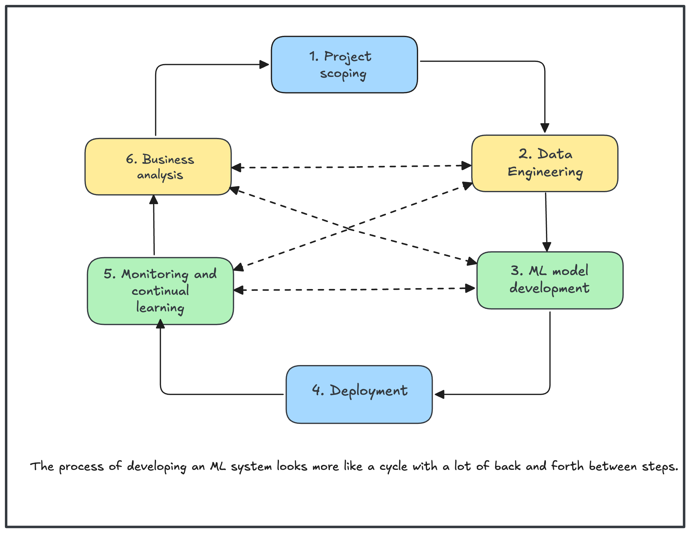

# **Introduction to Machine Learning Systems Design**

ML systems design takes a system approach to `MLOps`, which means
that we’ll consider an ML system holistically to ensure that all the components—the
`business requirements`, the `data stack`, `infrastructure`, `deployment`, `monitoring`, etc.—
and their stakeholders can work together to satisfy the specified objectives and
requirements. Before we develop an ML system, we must understand why this system is needed. If this system is built for a
business, it must be driven by `business objectives`, which will need to be translated
into ML objectives to guide the development of ML models.

## **Business and ML Objectives**
When working on an ML project, data scientists tend to care about the ML objectives: the metrics
they can measure about the performance of their ML models such as `accuracy`, `F1-score`, `inference latency`, etc. They get excited about improving their model’s accuracy from `94%` to `94.2%` and might spend a ton of resources—`data`, `compute`, and `engineering` time—to achieve that.

But the truth is: most companies don’t care about the `fancy ML metrics`. They don’t care about increasing a model’s accuracy from `94%` to `94.2%` unless it moves some business metrics. A pattern I see in many short-lived ML projects is that the data
scientists become too focused on hacking ML metrics without paying attention to business metrics. Their managers, however, only care about business metrics and, after failing to see how an ML project can help push their business metrics, kill the
projects prematurely (and possibly let go of the data science team involved).

So what metrics do companies care about? While most companies want to convince you otherwise, the sole purpose of businesses, according to the Nobel-winning economist `Milton Friedman`, is to maximize profits for shareholders. The ultimate goal of any project within a business is, therefore, to increase profits, either directly or indirectly: directly such as increasing sales (conversion rates) and cutting costs; indirectly such as higher customer satisfaction and increasing time spent on a website.

For an ML project to succeed within a business organization, it’s crucial to tie the
performance of an ML system to the overall business performance. What business
performance metrics is the new ML system supposed to influence, e.g., `the amount of ads revenue`, `the number of monthly active users?`

- Imagine that you work for an ecommerce site that cares about purchase-through rate
and you want to move your recommender system from `batch prediction` to `online
prediction`. You might reason that `online prediction` will enable recommendations
more relevant to users right now, which can lead to a `higher purchase-through rate`.
You can even do an experiment to show that online prediction can improve your
recommender system’s predictive accuracy by `X%` and, historically on your site, each
percent increase in the recommender system’s predictive accuracy led to a certain
increase in purchase-through rate.

- One of the reasons why predicting `ad click-through rates` and `fraud detection` are
among the most popular use cases for ML today is that it’s easy to map ML models’
performance to business metrics: every increase in click-through rate results in actual
ad revenue, and every fraudulent transaction stopped results in actual money saved.

- Many companies create their own metrics to map business metrics to ML metrics.
For example, `Netflix` measures the performance of their recommender system using
take-rate: the number of quality plays divided by the number of recommendations
a user sees. The higher the take-rate, the better the recommender system. Netflix
also put a recommender system’s take-rate in the context of their other business
metrics like `total streaming hours` and `subscription cancellation rate`. They found that
a higher take-rate also results in higher total streaming hours and lower subscription
cancellation rates.

- The effect of an ML project on business objectives can be hard to reason about. For
example, an ML model that gives customers more personalized solutions can make
them happier, which makes them spend more money on your services. The same ML
model can also solve their problems faster, which makes them spend less money on
your services.

- To gain a definite answer on the question of how ML metrics influence business
metrics, experiments are often needed. Many companies do that with experiments
like `A/B testing` and choose the model that leads to better business metrics, regardless
of whether this model has better ML metrics.

When evaluating ML solutions through the business lens, it’s important to be realistic about the expected returns. Due to all the hype surrounding ML, generated both by the media and by practitioners with a vested interest in ML adoption, some
companies might have the notion that ML can magically transform their businesses overnight.

## **Requirements for ML Systems**
The specified requirements for an ML system
vary from use case to use case. However, most systems should have these four characteristics: `reliability`, `scalability`, `maintainability`, and `adaptability`.

1. **Reliability**

The system should continue to perform the correct function at the desired level of
performance even in the face of adversity (hardware or software faults, and even
human error).

“Correctness” might be difficult to determine for ML systems. For example, your
system might call the predict function—e.g., `model.predict()` correctly, but the
predictions are wrong. How do we know if a prediction is wrong if we don’t have
ground truth labels to compare it with?

With traditional software systems, you often get a warning, such as a system crash
or runtime error or 404. However, ML systems can fail silently. End users don’t even
know that the system has failed and might have kept on using it as if it were working.

2. **Scalability**

There are multiple ways an ML system can grow. It can grow in complexity. Last year
you used a `logistic regression model` that fit into an Amazon Web Services (AWS)
free tier instance with `1 GB` of RAM, but this year, you switched to a 100-million-
parameter neural network that requires `16 GB` of RAM to generate predictions.

Your ML system can grow in traffic volume. When you started deploying an ML
system, you only served `10,000 prediction` requests daily. However, as your company’s
user base grows, the number of prediction requests your ML system serves daily
fluctuates between 1 million and 10 million.

An ML system might grow in ML model count. Initially, you might have only one
model for one use case, such as detecting the trending hashtags on a social network
site like `Twitter`. However, over time, you want to add more features to this use
case, so you’ll add one more to filter out `NSFW` (not safe for work) content and
another model to filter out tweets generated by bots. This growth pattern is especially common in ML systems that target enterprise use cases. Initially, a startup might serve only one enterprise customer, which means this startup only has one model. However, as this startup gains more customers, they might have one model for each
customer. A startup I worked with had `8,000` models in production for their `8,000` enterprise customers.

Whichever way your system grows, there should be reasonable ways of dealing with that growth. When talking about scalability most people think of resource scaling `(horizontal scaling)`, which consists of up-scaling (expanding the resources to handle growth) and downscaling (reducing the resources when not needed).

For example, at peak, your system might require `100 GPUs` (graphics processing units). However, most of the time, it needs only `10 GPUs`. Keeping `100 GPUs` up all the time can be costly, so your system should be able to scale down to `10 GPUs`.

3. **Maintainability**

There are many people who will work on an ML system. They are `ML engineers`, `DevOps engineers`, and subject matter experts (SMEs). They might come from very different backgrounds, with very different programming languages and tools, and
might own different parts of the process.

It’s important to structure your workloads and set up your infrastructure in such a way that different contributors can work using tools that they are comfortable with, instead of one group of contributors forcing their tools onto other groups.
Code should be documented. Code, data, and artifacts should be versioned. Models should be sufficiently reproducible so that even when the original authors are not around, other contributors can have sufficient contexts to build on their work. When
a problem occurs, different contributors should be able to work together to identify the problem and implement a solution without finger-pointing.

4. **Adaptability**

To adapt to shifting data distributions and business requirements, the system should
have some capacity for both discovering aspects for performance improvement and allowing updates without service interruption.
Because ML systems are part code, part data, and data can change quickly, ML systems need to be able to evolve quickly. This is tightly linked to maintainability.

## **Iterative Process**

Developing an ML system is an iterative and, in most cases, never-ending process.10
Once a system is put into production, it’ll need to be continually monitored and
updated.

Example of a workflow you might encounter when building an ML model to predict whether an `ad` should be shown when users enter a search query:

1. Choose a metric to optimize. For example, you might want to optimize for
impressions—the number of times an ad is shown.
2. Collect data and obtain labels.
3. Engineer features.
4. Train models.
5. During error analysis, you realize that errors are caused by the wrong labels, so
you relabel the data.
6. Train the model again.
7. During error analysis, you realize that your model always predicts that an ad
shouldn’t be shown, and the reason is because 99.99% of the data you have have
NEGATIVE labels (ads that shouldn’t be shown). So you have to collect more
data of ads that should be shown.
8. Train the model again.
9. The model performs well on your existing test data, which is by now two months
old. However, it performs poorly on the data from yesterday. Your model is now
stale, so you need to update it on more recent data.
10. Train the model again.
11. Deploy the model.
12. The model seems to be performing well, but then the businesspeople come
knocking on your door asking why the revenue is decreasing. It turns out the
ads are being shown, but few people click on them. So you want to change your
model to optimize for ad click-through rate instead.
13. Go to `step 1`.

Figure: An oversimplified representation of what the iterative process for developing ML systems in production looks like from the perspective of an ML Engineer. 

### Brief look at what each iterative process looks like:

**step 1: Project scoping:**

A project starts with scoping the project, laying out goals, objectives, and con‐
straints. Stakeholders should be identified and involved. Resources should be
estimated and allocated

**step 2: Data engineering:**

A vast majority of ML models today learn from data, so developing ML models
starts with engineering data.

**step 3: ML model development:**

With the initial set of training data, we’ll need to extract features and develop
initial models leveraging these features.

**step 4: Deployment:**

After a model is developed, it needs to be made accessible to users. Developing
an ML system is like writing—you will never reach the point when your system
is done. But you do reach the point when you have to put your system out there.

**step 5: Monitoring and continual learning:**

Once in production, models need to be monitored for performance decay and
maintained to be adaptive to changing environments and changing requirements.

**step 6: Business analysis:**

Model performance needs to be evaluated against business goals and analyzed
to generate business insights. These insights can then be used to eliminate unpro‐
ductive projects or scope out new projects.

## **Framing ML Problems**

Framing an ML problem correctly is critical to developing effective models. It involves understanding the context, defining objectives, choosing the right type of learning, and identifying appropriate data and metrics.

### **1. Define the Business or Research Objective**

* What problem is being solved?
* What decision or automation is desired?
* How will success be measured in the real world?

> **Example:** Predict customer churn to reduce loss in a subscription business.

---

### **2. Determine the ML Task Type**

Choose the ML paradigm that fits the problem:

| Task Type                | Description                                      | Output Type                          |
| ------------------------ | ------------------------------------------------ | ------------------------------------ |
| Supervised Learning      | Learn from labeled data                          | Classification or Regression         |
| Unsupervised Learning    | Find structure in unlabeled data                 | Clustering, Dimensionality Reduction |
| Reinforcement Learning   | Learn via interaction and reward signals         | Optimal Policies or Actions          |
| Self-Supervised Learning | Predict part of the data from other parts        | Representation Learning              |
| Semi-Supervised Learning | Learn from a small labeled + large unlabeled set | Hybrid classification/clustering     |

#### **Classification versus regression**

Classification models classify inputs into different categories. For example, you want
to classify each email to be either spam or not spam. Regression models output a
continuous value. An example is a house prediction model that outputs the price of a
given house.

A regression model can easily be framed as a classification model and vice versa. For
example, house prediction can become a classification task if we quantize the house
prices into buckets such as under `$100,000`, `$100,000–$200,000`, `$200,000–$500,000`,
and so forth and predict the bucket the house should be in.

#### **Binary versus multiclass classification**

Within classification problems, the fewer classes there are to classify, the simpler the
problem is. The simplest is binary classification, where there are only two possible
classes. Examples of binary classification include classifying whether a comment is
toxic, whether a lung scan shows signs of cancer, whether a transaction is fraudulent.

When there are more than two classes, the problem becomes multiclass classification.
Dealing with binary classification problems is much easier than dealing with multi‐
class problems. For example, calculating F1 and visualizing confusion matrices are a
lot more intuitive when there are only two classes.

When the number of classes is high, such as disease diagnosis where the number
of diseases can go up to thousands or product classifications where the number of
products can go up to tens of thousands, we say the classification task has high
cardinality. 

When the number of classes is large, hierarchical classification might be useful. In
hierarchical classification, you have a classifier to first classify each example into one
of the large groups. Then you have another classifier to classify this example into one
of the subgroups. For example, for product classification, you can first classify each
product into one of the four main categories: electronics, home and kitchen, fashion,
or pet supplies. After a product has been classified into a category, say fashion, you
can use another classifier to put this product into one of the subgroups: shoes, shirts,
jeans, or accessories.

#### **Multiclass versus multilabel classification**

In both binary and multiclass classification, each example belongs to exactly one class. When an example can belong to multiple classes, we have a multilabel classification problem. For example, when building a model to classify articles into four topics; tech, entertainment, finance, and politics, an article can be in both tech and finance.

There are two major approaches to multilabel classification problems. The first is to treat it as you would a multiclass classification. In multiclass classification, if there
are four possible classes [tech, entertainment, finance, politics] and the label for an example is entertainment, you represent this label with the vector `[0, 1, 0, 0]`. In
multilabel classification, if an example has both labels entertainment and finance, its label will be represented as `[0, 1, 1, 0]`.

The varying number of classes makes it hard to extract predictions from raw probability. Consider the same task of classifying articles into four topics. Imagine
that, given an article, your model outputs this raw probability distribution: `[0.45, 0.2, 0.02, 0.33]`. In the `multiclass` setting, when you know that an example can belong to
only one category, you simply pick the category with the highest probability, which is `0.45` in this case. In the multilabel setting, because you don’t know how many
categories an example can belong to, you might pick the two highest probability categories (corresponding to `0.45` and `0.33`) or three highest probability categories
(corresponding to `0.45`, `0.2`, and `0.33`).

---

### **3. Identify Input Features and Output Labels**

* **Inputs (X):** What data is available and relevant?
* **Outputs (Y):** What is being predicted or inferred?

> **Example:**
> Inputs = customer demographics + usage stats
> Output = binary churn (yes/no)

---

### **4. Define the Evaluation Metric**

Choose based on the business context and ML task:

| Task           | Common Metrics                         |
| -------------- | -------------------------------------- |
| Classification | Accuracy, F1-score, ROC-AUC            |
| Regression     | MSE, MAE, R²                           |
| Ranking        | NDCG, MAP, Precision\@K                |
| Clustering     | Silhouette Score, Davies–Bouldin Index |
| Recommendation | Hit Rate, Recall\@K, Coverage          |

---

### **5. Frame the Problem Mathematically**

Convert to an optimization or learning formulation:

* **Classification:** Learn $`f: \mathbb{R}^n \rightarrow {1,...,k}`$
* **Regression:** Learn $`f: \mathbb{R}^n \rightarrow \mathbb{R}`$
* **Clustering:** Find $`C\_1,...,C\_k`$ minimizing intra-cluster variance
* **Reinforcement Learning:** Maximize expected cumulative reward

---

### **6. Choose the Right Level of Granularity**

* Frame at the right resolution:

  * Per-user or per-session?
  * Predict once per day or in real-time?

> **Example:** Predict sales per store per week vs per item per day.

---

### **7. Check for Framing Alternatives**

Some problems can be reframed more effectively:

| Problem             | Alternative Framing Examples                                  |
| ------------------- | ------------------------------------------------------------- |
| Anomaly Detection   | Binary classification: "normal" vs "anomalous"                |
| Forecasting         | Regression or sequence modeling (e.g., LSTM)                  |
| Multi-class Problem | Decompose into binary one-vs-rest models                      |
| Cold-start Problem  | Use content-based features instead of collaborative filtering |

---

### **8. Understand Constraints and Context**

* Data availability, quality, and cost
* Latency, interpretability, and deployment environment
* Legal, fairness, and ethical considerations

---

### **9. Consider a Baseline or Heuristic**

Start with a simple rule or statistical model to benchmark ML performance.

> **Example:** “Churn if no activity in last 30 days” as a rule-based baseline.

---

### **10. Iterate Based on Insights and Results**

* Reframe based on feedback, errors, or data limitations
* Explore feature engineering, label reformulation, or alternative model targets

---

### **Summary**

Framing an ML problem well involves:

1. Clear objectives
2. Choosing the right task type
3. Proper input/output mapping
4. Evaluation metric alignment
5. Mathematical formulation
6. Granularity tuning
7. Contextual understanding
8. Practical constraints
9. Establishing a baseline
10. Iterative refinement

Proper framing ensures relevance, feasibility, and ultimately, the success of the ML solution.

---

