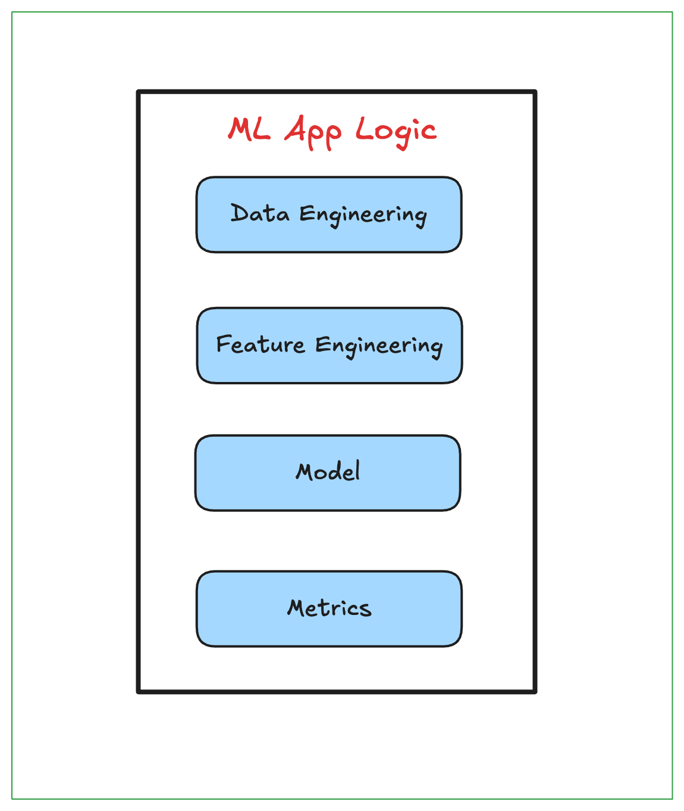
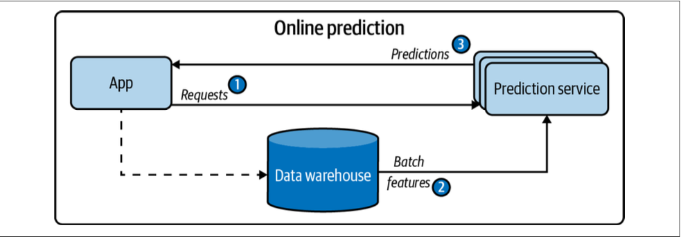
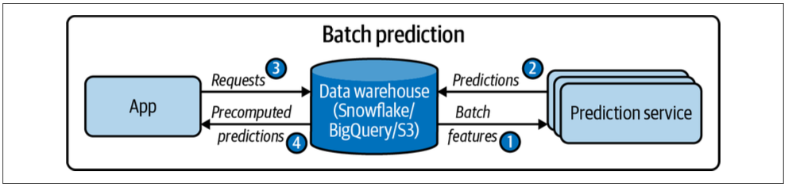
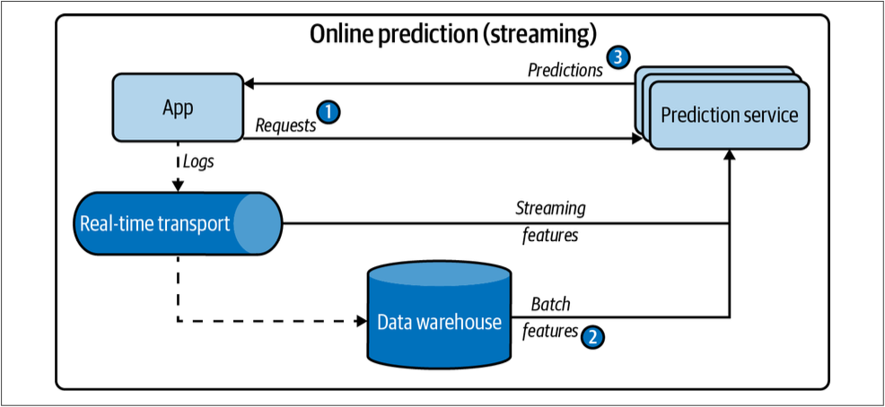
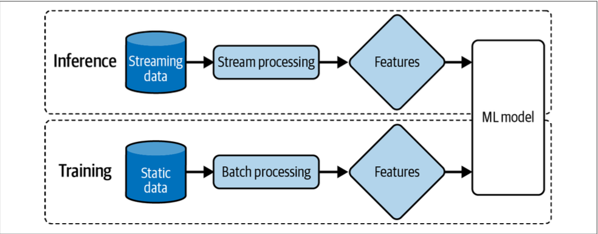
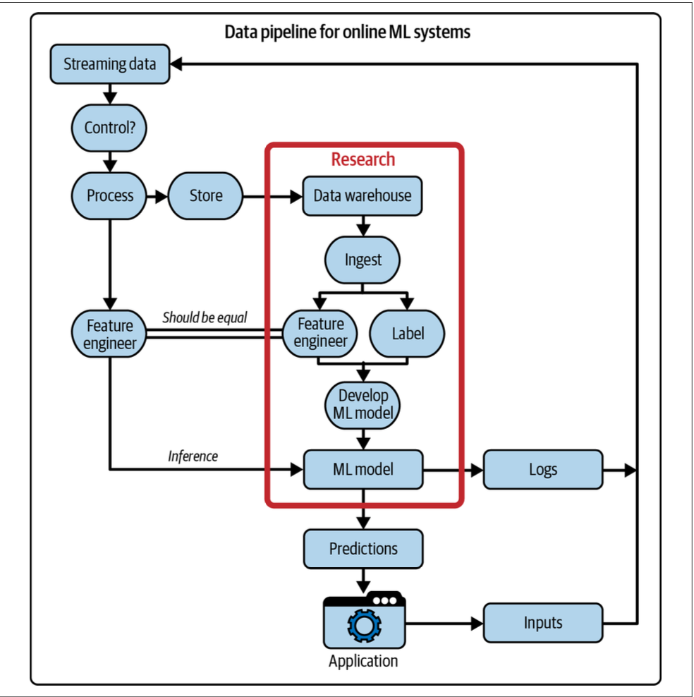
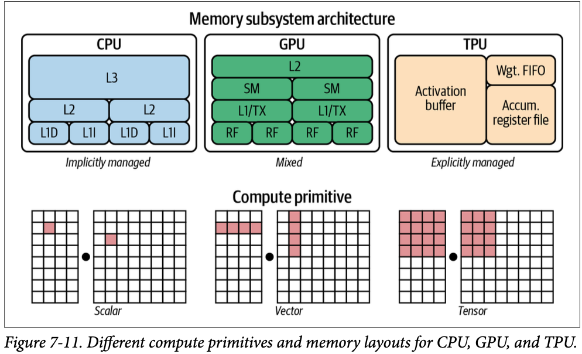
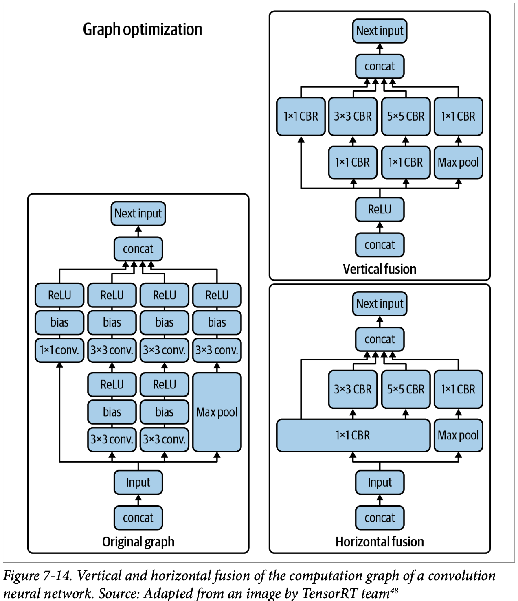
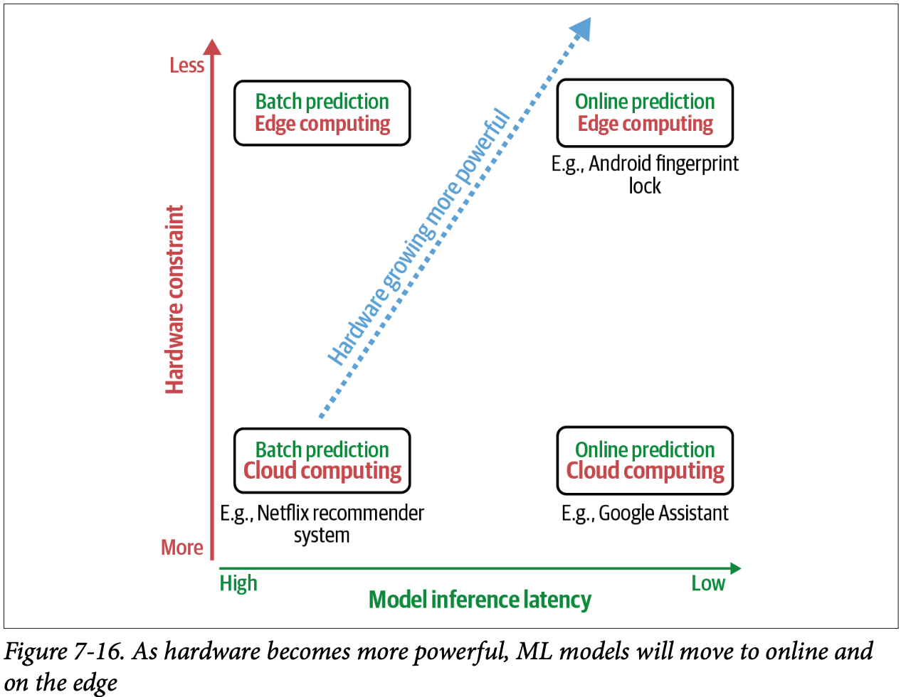

# Model Deployment and Prediction Service

Moving the model from the development environment to the production environment creates a whole new host of problems. The first is how to keep that model in production, and how to continually monitor models to detect issues and address them as fast as possible.

## Machine Learning Deployment Myths

Deploying an ML model can be very different from deploying a traditonal software program.

### Myth 1: You Only Deploy One or Two ML Models at a Time

Companies have many, many ML models. An application might have different features, and each feature might require its own model. 

**Example:** 

** Different tasks that leverage ML at `Netflix`.

- Content Valuation
- Predict Churn
- Predict Quality of Network
- Screenplay Analysis Using NLP
- Machine Translation
- Fraud Detection
- Title Portfolio Optimization
- Classify Support Tickets
- Intelligent infrastructure
- Content Tagging

** Uber has thousands of models in production.

** Google has thousands of models training concurrently with hundreds of billions parameters in size.

** Major Organizations have more than `100 models` in production.

### Myth 2: If We Don’t Do Anything, Model Performance Remains the Same

ML systems aren't immune to `software rot` or `bit rot`. ML systems suffer from what are known as data `distribution shifts`, when the data distribution your model encounters in production is different from the data distribution it was trained on. Therefore, an ML model tends to perform best right after training and to degrade over time.

### Myth 3: You Won’t Need to Update Your Models as Much

Since a model’s performance decays over time, we want to update it as fast as possible. This is an area of ML where we should learn from existing `DevOps` best practices. Even back in 2015, people were already constantly pushing out updates to their systems. Etsy deployed 50 times/day, Netflix thousands of times per day, AWS every
11.7 seconds.

### Myth 4: Most ML Engineers Don’t Need to Worry About Scale

What `“scale”` means varies from application to application, but examples include a system that serves hundreds of queries per second or millions of users a month. 

## Batch Prediction Versus Online Prediction

One fundamental decision you’ll have to make that will affect both your end users and developers working on your system is how it generates and serves its predictions to end users: `online` or `batch`.

- `Batch prediction`, which uses only batch features.

- `Online prediction` that uses only batch features (e.g., precomputed embeddings).

- `Online prediction` that uses both batch features and streaming features. This is also known as streaming prediction.

### Online Prediction:

Online prediction is when predictions are generated and returned as soon as requests for these predictions arrive. For example, you enter an English sentence into `Google Translate` and get back its `French translation` immediately. `Online prediction` is also known as `on-demand prediction`. 

Traditionally, when doing online prediction, requests are sent to the prediction service via `RESTful APIs` (e.g., HTTP requests). When prediction requests are sent via `HTTP requests`, online prediction is also known as `synchronous prediction`: predictions are generated in synchronization with requests.

### Batch Prediction:

Batch prediction is when predictions are generated periodically or whenever triggered. The predictions are stored somewhere, such as in SQL tables or an in-memory database, and retrieved as needed. For example, Netflix might generate movie recommendations for all of its users every four hours, and the precomputed recommendations are fetched and shown to users when they log on to Netflix. `Batch prediction` is also
known as `asynchronous prediction`: predictions are generated `asynchronously` with requests.

Features computed from historical data, such as data in databases and data warehouses, are `batch features`. Features computed from streaming data—data in real-time transports—are streaming features. In `batch prediction`, only `batch features` are used. In `online prediction`, however, it’s possible to use both `batch features` and `streaming features`.

`streaming prediction` for online prediction uses both streaming features and batch features.

`Online prediction` provides immediate results for individual data points or small batches as they arrive, whereas `batch prediction` processes large datasets `offline` at once. `Online prediction` is suitable for `real-time applications` like `fraud detection`, while `batch prediction` is useful for scenarios like generating `reports` or updating large datasets. 

### From Batch Prediction to Online Prediction

The more natural way to serve predictions is probably `online`. You give your model an input and it generates a prediction as soon as it receives that input. This is likely how most people interact with their models while prototyping. This is also likely easier to do for most companies when first deploying a model. You export your model, upload the exported model to `Amazon SageMaker` or `Google App Engine`, and get back an exposed
endpoint. Now, if you send a request that contains an input to that endpoint, it will send back a prediction generated on that input.

A problem with online prediction is that your model might take too long to generate predictions. Instead of generating predictions as soon as they arrive, what if you `compute predictions` in advance and store them in your `database`, and fetch them when requests arrive? This is exactly what `batch prediction` does. With this approach, you can generate predictions for multiple inputs at once, leveraging `distributed techniques` to process a high volume of samples efficiently.

Because the predictions are precomputed, you don’t have to worry about how long it’ll take your models to generate predictions. For this reason, `batch prediction` can also be seen as a trick to reduce the inference latency of more complex models—the time it takes to retrieve a prediction is usually less than the time it takes to generate it.

Batch prediction is good for when you want to generate a lot of predictions and don’t need the results immediately. You don’t have to use all the predictions generated. For example, you can make predictions for all customers on how likely they are to buy a new product, and reach out to the top 10%.

Another problem with batch prediction is that you need to know what requests to generate predictions for in advance. In the case of recommending movies for users, you know in advance how many users to generate recommendations for. However, for cases when you have unpredictable queries—if you have a system to translate from English to French, it might be impossible to anticipate every possible English text to be translated—you need to use online prediction to generate predictions as requests arrive.

Batch prediction is a workaround for when online prediction isn’t cheap enough or isn’t fast enough. Why generate one million predictions in advance and worry about storing and retrieving them if you can generate each prediction as needed at the exact same cost and same speed?

As hardware becomes more customized and powerful and better techniques are being developed to allow faster, cheaper online predictions, `online prediction` might become the default.

To overcome the latency challenge of online prediction, two components are required:

• A (near) `real-time pipeline` that can work with incoming data, extract streaming features (if needed), input them into a model, and return a prediction in near real time. A streaming pipeline with real-time transport and a stream computation engine can help with that.

• A model that can generate predictions at a speed acceptable to its end users. For most consumer apps, this means milliseconds.

### Unifying Batch Pipeline and Streaming Pipeline

Batch prediction is largely a product of legacy systems. When companies started with ML, they leveraged their existing batch systems to make predictions. When these companies want to use streaming features for their online prediction, they need to build a separate streaming pipeline.

Having two different pipelines to process your data is a common cause for bugs in ML production. One cause for bugs is when the changes in one pipeline aren’t correctly replicated in the other, leading to two pipelines extracting two different sets of features. This is especially common if the two pipelines are maintained by two different teams, such as the ML team maintains the batch pipeline for training while the deployment team maintains the stream pipeline for inference.

`Fig: Having two different pipelines for training and inference is a common source for bugs for ML in production`

Below, is a more detailed but also more complex feature of the data pipeline for `ML Systems` that do online prediction. The boxed element labeled 
`Research` is what people are often exposed to in an academic environment.

`Fig: A data pipeline for ML systems that do online prediction`

## Model Compression

If the model you want to deploy takes too long to generate predictions, there are three main approaches to reduce its inference latency: 

- make it do inference faster, 
- make the model smaller, or 
- make the hardware it’s deployed on run faster.

The process of making a model smaller is called `model compression`, and the process to make it do inference faster is called `inference optimization`. Originally, `model compression` was to make models fit on edge devices. However, making models smaller often makes them run faster.

There are four types of model compression techniques that you might come across the most often, they are;

1. **Low-Rank Factorization:**

The key idea behind `low-rank factorization` is to replace `high-dimensional tensors` with `lower-dimensional tensors`. One type of low-rank factorization is `compact convolutional filters`, where the over-parameterized (having too many parameters) convolution filters are replaced with compact blocks to both reduce the number of parameters and increase speed.

For example, by using a number of strategies including replacing `3 × 3 convolution` with `1 × 1 convolution`, `SqueezeNets` achieves `AlexNet`-level accuracy on ImageNet with 50 times fewer parameters.

2. **Knowledge Distillation:**

`Knowledge distillation` is a method in which a small model `(student)` is trained to mimic a larger model or ensemble of models `(teacher)`. The smaller model is what you’ll deploy. Even though the student is often trained after a pretrained teacher, both may also be trained at the same time.One example of a distilled network used in production is `DistilBERT`, which reduces the size of a `BERT` model by 40% while retaining 97% of its language understanding capabilities and being 60% faster.

The advantage of this approach is that it can work regardless of the architectural differences between the teacher and the student networks.

This method is also sensitive to applications and model architectures, and therefore hasn’t found wide usage in production.

3. **Pruning:**

Pruning was a method originally used for decision trees where you remove sections of a tree that are uncritical and redundant for classification. As neural networks gained wider adoption, people started to realize that neural networks are over-parameterized and began to find ways to reduce the workload caused by the extra parameters.

Pruning, in the context of neural networks, has two meanings. One is to remove entire nodes of a neural network, which means changing its architecture and reducing its number of parameters. The more common meaning is to find parameters least useful to predictions and set them to `0`. In this case, pruning doesn’t reduce the total number of parameters, only the number of nonzero parameters. The architecture of the neural network remains the same. This helps with reducing the size of a model because pruning makes a neural network more sparse, and sparse architecture tends
to require less storage space than dense structure. 

4. **Quantization:**

Quantization is the most general and commonly used model compression method. It’s straightforward to do and generalizes over tasks and architectures. Quantization not only reduces memory footprint but also improves the computation speed. First, it allows us to increase our batch size. Second, less precision speeds up computation, which further reduces training time and inference latency. 

Quantization can either happen during training `(quantization aware training)`, where models are trained in `lower precision`, or post-training, where models are trained in `single-precision` floating point and then quantized for inference. Using quantization during training means that you can use less memory for each parameter, which allows you to train larger models on the same hardware.

NVIDIA introduced `Tensor Cores`, processing units that support `mixed-precision` training. Google `TPUs (tensor processing units)` also
support training with Bfloat16 (16-bit Brain Floating Point Format), which the company dubbed “the secret to high performance on Cloud TPUs.” Training in fixed-point is not yet as popular but has had a lot of promising results.

## ML on the Cloud and on the Edge

Another decision you’ll want to consider is where your model’s computation will happen: on the `cloud` or on the `edge`. On the cloud means a large chunk of computation is done on the cloud, either `public clouds` or `private clouds`. On the edge means a large chunk of computation is done on consumer devices—such as browsers, phones, laptops, smartwatches, cars, security cameras, robots, embedded devices, FPGAs (field programmable gate arrays), and ASICs (application-specific integrated circuits)—which are also known as edge devices.

The easiest way is to package your model up and deploy it via a managed cloud service such as `AWS` or `GCP`, and this is how many companies deploy when they get started in ML. Cloud services have done an incredible job to make it easy for companies to bring ML models into production.

However, there are many downsides to cloud deployment. The first is `cost`. ML models can be compute-intensive, and compute is expensive. As their cloud bills climb, more and more companies are looking for ways to push their computations to edge devices. The more computation is done on the edge, the less is required on the cloud, and the less they’ll have to pay for servers.

Other than help with controlling costs, there are many properties that make `edge computing` appealing. The first is that it allows your applications to run where cloud computing cannot. When your models are on public clouds, they rely on stable internet connections to send data to the cloud and back. `Edge computing` allows your models to work in situations where there are no `internet connections` or where the connections are unreliable, such as in rural areas or developing countries. 

Putting your models on the edge is also appealing when handling sensitive user data. ML on the cloud means that your systems might have to send user data over networks, making it susceptible to being intercepted. 

To move computation to the edge, the edge devices have to be powerful enough to handle the computation, have enough memory to store ML models and load them into memory, as well as have enough battery or be connected to an energy source to power the application for a reasonable amount of time.

Because of the many benefits that edge computing has over cloud computing, companies are in a race to develop edge devices optimized for different ML use cases.

### Compiling and Optimizing Models for Edge Devices

Providing support for a framework on a hardware backend is time-consuming and engineering-intensive. Mapping from ML workloads to a hardware backend requires understanding and taking advantage of that hardware’s design, and different hardware backends have different memory layouts and compute primitives.

For example, the compute primitive of `CPUs` used to be a number (scalar) and the compute primitive of GPUs used to be a one-dimensional vector, whereas the compute primitive of `TPUs` is a two-dimensional vector (tensor). Performing a convolution operator will be very different with one-dimensional vectors compared to two-dimensional vectors. Similarly, you’d need to take into account different `L1`, `L2`, and `L3` layouts and buffer sizes to use them efficiently.

Because of this challenge, framework developers tend to focus on providing support to only a handful of server-class hardware, and hardware vendors tend to offer their own kernel libraries for a narrow range of frameworks. Deploying ML models to new hardware requires significant manual effort.

#### Model optimization

A typical ML workflow consists of many frameworks and libraries. For example, you might use `pandas/dask/ray` to extract features from your data. You might use `NumPy` to perform vectorization. You might use a pretrained model like `Hugging Face’s Transformers` to generate features, then make predictions using an ensemble of models built with various frameworks like sklearn, TensorFlow, or LightGBM.

Even though individual functions in these frameworks might be optimized, there’s little to no optimization across frameworks. A naive way of moving data across these functions for computation can cause an order of magnitude slowdown in the whole workflow. A study by researchers at Stanford DAWN lab found that typical ML workloads using NumPy, pandas, and TensorFlow run 23 times slower in one thread compared to hand-optimized code.

There are standard local optimization techniques that are known to speed up your model, most of them making things run in parallel or reducing memory access on chips. Here are four of the common techniques:

- Vectorization: Given a loop or a nested loop, instead of executing it one item at a time, execute multiple elements contiguous in memory at the same time to reduce latency caused by data I/O.

- Parallelization: Given an input array (or n-dimensional array), divide it into different, independent work chunks, and do the operation on each chunk individually.

- Loop tiling: Change the data accessing order in a loop to leverage hardware’s memory layout and cache. This kind of optimization is hardware dependent. A good access pattern on CPUs is not a good access pattern on GPUs.

- Operator fusion: Fuse multiple operators into one to avoid redundant memory access.

## Summary

Online prediction makes your model more responsive to users’ changing preferences, but you have to worry about inference latency. Batch prediction is a workaround for when your models take too long to generate predictions, but it makes your model less flexible.

Similarly, doing inference on the cloud is easy to set up, but it becomes impractical with network latency and cloud cost. Doing inference on the edge requires having edge devices with sufficient compute power, memory, and battery. However, I believe that most of these challenges are due to the limitations of the hardware that ML models run on. As hardware becomes more powerful and optimized for ML, I believe that ML systems will transition to making online prediction on-device

