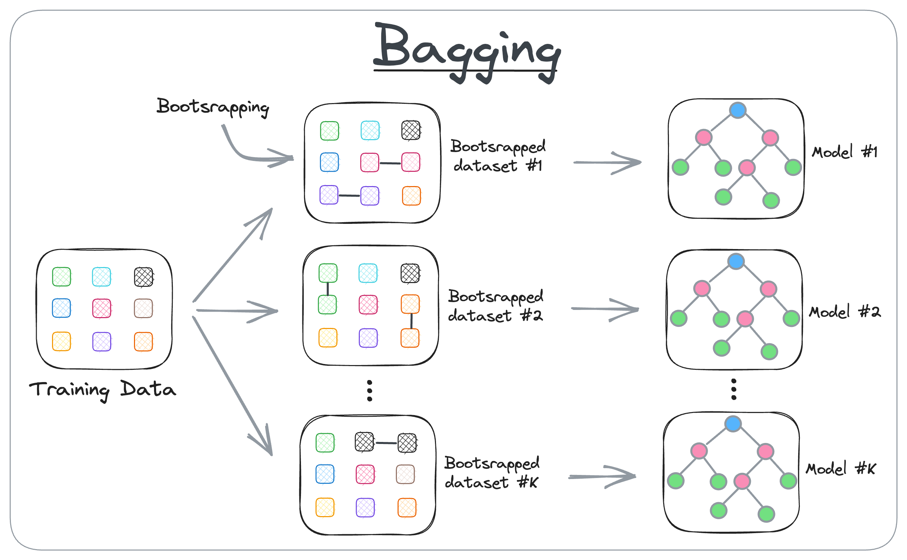
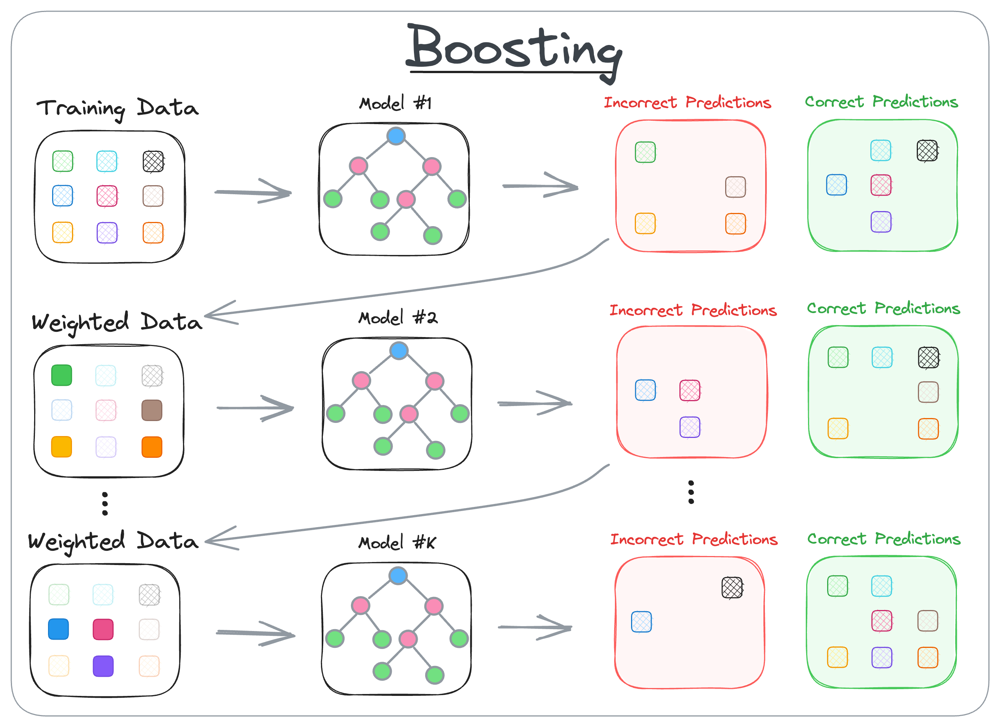
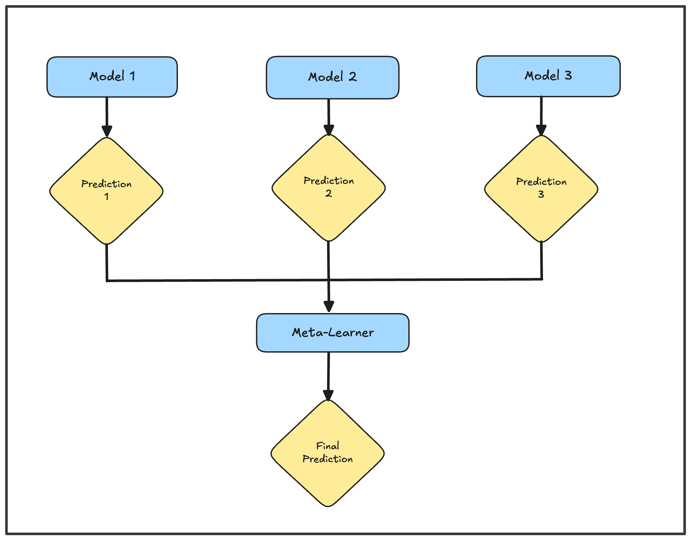
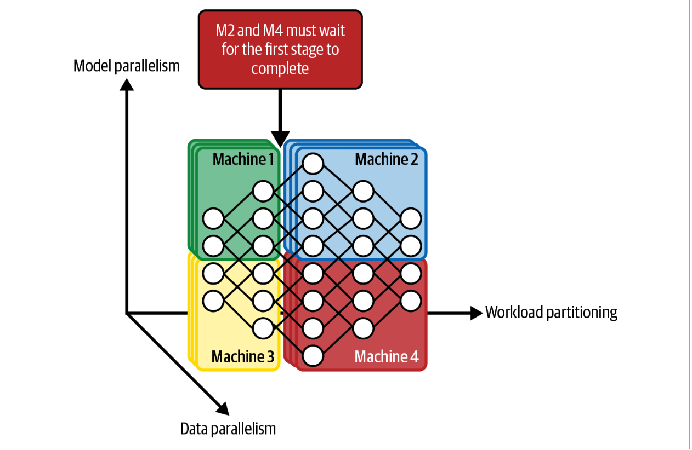
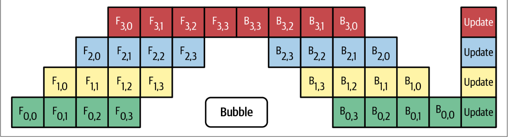
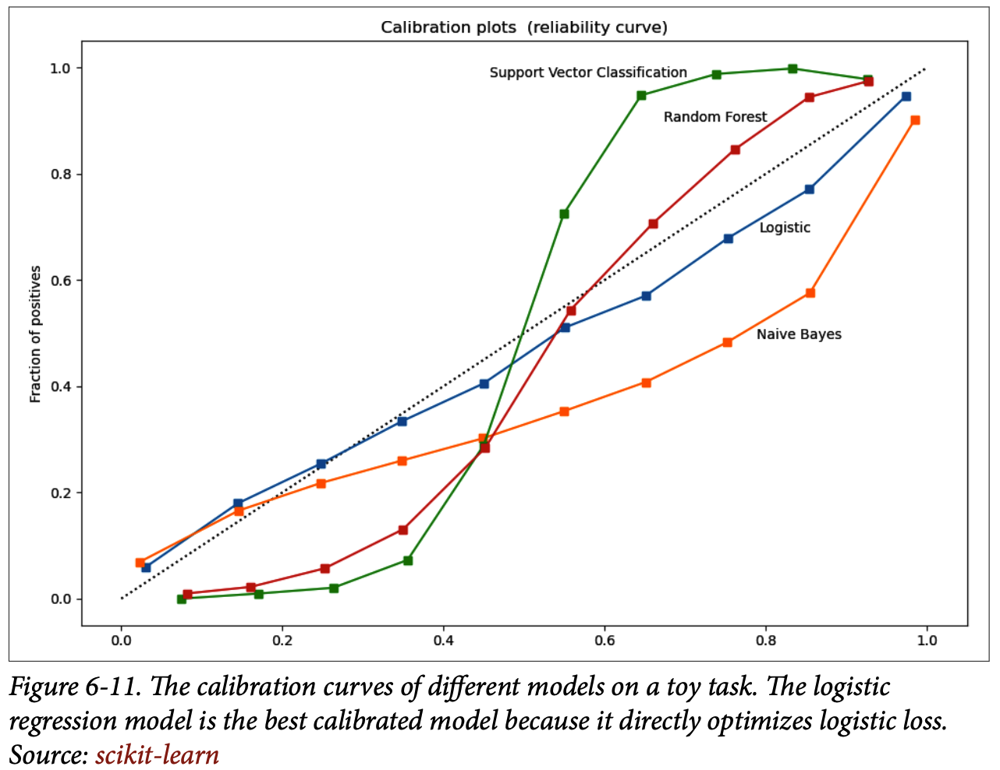

# Model Development and Offline Evaluation

This section discusses different aspects of model development, such as 
- `Debugging`
- `Experiment tracking` and `versioning`
- `Distributed training` and `AutoML`
- `Model Evaluation`
    - `perturbation tests`
    - `invariance tests`
    - `model calibration`
    - `slide-based evaluation`

## **Model Development and Training**

The following segment explores essential steps for developing and training models: evaluating various ML approaches, building ensembles, tracking experiments and versions, scaling through distributed training, and concluding with AutoML for automated model selection.

### **Evaluating ML Models**

There are many possible solutions to any given problem. Given a task that can leverage ML in its solution, you might wonder what ML algorithm you should use for it. 

When selecting a model for your problem, you don’t choose from every possible model out there, but usually focus on a set of models suitable for your problem. For example, if your boss tells you to build a system to detect toxic tweets, you know that this is a text classification problem—given a piece of text, classify whether it’s toxic or not—and common models for text classification include naive Bayes, logistic regression, recurrent neural networks, and transformer-based models such as BERT, GPT, and their variants.

If your client wants you to build a system to detect fraudulent transactions, you know that this is the classic abnormality detection problem—fraudulent transactions are abnormalities that you want to detect—and common algorithms for this problem are many, including k-nearest neighbors, isolation forest, clustering, and neural networks.

When considering what model to use, it’s important to consider not only the model’s performance, measured by metrics such as `accuracy`, `F1 score`, and `log loss`, but also its other properties, such as how much `data`, `compute`, and `time` it needs to train, what’s its `inference latency`, and `interpretability`. For example, a simple logistic regression model might have lower accuracy than a complex neural network, but it requires less labeled data to start, it’s much faster to train, it’s much easier to deploy, and it’s also much easier to explain why it’s making certain predictions.

#### Six steps for Model Selection

1. **Avoid the state-of-the-art trap**: While it’s essential to stay up to date with new technologies and beneficial to evaluate them for your business, the most important thing to do when solving a problem is finding solutions that can solve that problem. If there’s a solution that can solve your problem that is much cheaper and simpler than state-of-the-art models, use the simpler solution.

2. **Start with the simplest models**: Simplicity serves three purposes. 

First, simpler models are easier to deploy, and deploying your model early allows you to validate that your prediction pipeline is consistent with your training pipeline. 

Second, starting with something simple and adding more complex components step-by-step makes it easier to understand your model and debug it. 

Third, the simplest model serves as a baseline to which you can compare your more complex models.

3. **Avoid human biases in selecting models.**: There are a lot of `human biases` in evaluating models. Part of the process of evaluating an `ML architecture` is to experiment with different features and different sets of `hyperparameters` to find the best model of that architecture. If an engineer is more excited about an `architecture`, they will likely spend a lot more time experimenting with it, which might result in better-performing models for that `architecture`.

When comparing different architectures, it’s important to compare them under comparable setups. If you run 100 experiments for an architecture, it’s not fair to only run a couple of experiments for the architecture you’re evaluating it against. You might need to run 100 experiments for the other architecture too.

Because the performance of a model architecture depends heavily on the `context` it’s evaluated in—e.g., `the task`, `the training data`, `the test data`, `the hyperparameters`, etc. it’s extremely difficult to make claims that a model architecture is better than another architecture. The claim might be true in a context, but unlikely true for all possible contexts.

4. **Evaluate good performance now versus good performance later.**: The best model now does not always mean the best model two months from now. For example, a `tree-based model` might work better now because you don’t have a ton of data yet, but two months from now, you might be able to double your amount of training data, and your `neural network` might perform much better.

A simple way to estimate how your model’s performance might change with more data is to use `learning curves`. A `learning curve` of a model is a plot of its performance e.g., `training loss`, `training accuracy`, `validation accuracy` —against the number of training samples it uses.

A case scenario is when a team evaluates a `simple neural network` against a `collaborative filtering` model for making recommendations. When evaluating both models offline, the `collaborative filtering` model outperformed. However, the `simple neural network` can update itself with each incoming example, whereas the `collaborative filtering` has to look at all the data to update its underlying matrix.
The team decided to deploy both the `collaborative filtering` model and the `simple neural network`. They used the `collaborative filtering` model to make predictions for users, and continually trained the `simple neural network` in production with new, incoming data. After two weeks, the `simple neural network` was able to outperform the `collaborative filtering` model. While evaluating models, you might want to take into account their potential for improvements in the near future, and how easy/difficult it is to achieve those improvements.

5. **Evaluate trade-offs.**: There are many `trade-offs` you have to make when selecting models. Understanding what’s more important in the performance of your ML system will help you choose the most suitable model.

One classic example of `trade-off` is the `false positives` and `false negatives` trade-off. Reducing the number of `false positives` might increase the number of `false negatives`, and vice versa. In a task where `false positives` are more dangerous than `false negatives`, such as fingerprint unlocking (unauthorized people shouldn’t be classified as authorized and given access), you might prefer a model that makes fewer `false positives`. Similarly, in a task where `false negatives` are more dangerous than `false positives`, such as `COVID-19` screening (patients with `COVID-19` shouldn’t be classified as no `COVID-19`), you might prefer a model that makes fewer `false negatives`.

Another example of trade-off is `compute requirement` and `accuracy` a more complex model might deliver higher accuracy but might require a more powerful machine, such as a `GPU` instead of a `CPU`, to generate predictions with acceptable inference latency. Many people also care about the `interpretability` and `performance` trade-off. A more complex model can give a better performance, but its results are less interpretable.

6. **Understand your model’s assumptions.**: Understanding what assumptions a model makes and whether our data satisfies those assumptions can help you evaluate which model works best for your use case.

### **Ensembles**

When considering an ML solution to your problem, you might want to start with a system that contains just one model. After developing one single model, you might think about how to continue improving its performance. One method that has consistently given a performance boost is to use an `ensemble` of `multiple models` instead of just an individual model to make predictions. Each model in the ensemble is called a `base learner`. 

For example, for the task of predicting whether an email is `SPAM` or `NOT SPAM`, you might have three different models. The final prediction
for each email is the majority vote of all three models. So if at least two base learners output `SPAM`, the email will be classified as `SPAM`.

`Ensembling methods` are less favored in production because ensembles are more complex to deploy and harder to maintain. However, they are still common for tasks where a small performance boost can lead to a huge financial gain, such as predicting click-through rate for ads.

There are three ways to create an ensemble: `bagging`, `boosting`, and `stacking`. In addition to helping `boost performance`, according to several survey papers, `ensemble methods` such as `boosting` and `bagging`, together with `resampling`, have shown to help with `imbalanced datasets`.

1. **Bagging**: 

Bagging, shortened from `bootstrap aggregating`, is designed to improve both the training stability and accuracy of ML algorithms. It reduces variance and helps to avoid overfitting. 

Given a dataset, instead of training one `classifier` on the entire `dataset`, you sample with replacement to create different datasets, called `bootstraps`, and train a `classification` or `regression` model on each of these bootstraps. Sampling with replacement ensures that each bootstrap is created independently from its peers.

a. creates different subsets of data (this is called bootstrapping)

b. trains one model per subset

c. aggregates all predictions to get the final prediction

If the problem is classification, the final prediction is decided by the majority vote of all models. For example, if `10 classifiers` vote `SPAM` and `6 models` vote `NOT SPAM`, the final prediction is `SPAM`.

If the problem is regression, the final prediction is the `average` of all models’ predictions. `Bagging` generally improves `unstable methods`, such as `neural networks`, `classification` and `regression trees`, and subset selection in linear regression. However, it can mildly degrade the performance of stable methods such as `k-nearest neighbors`.

A `random forest` is an example of bagging. A `random forest` is a collection of `decision trees` constructed by both bagging and feature randomness, where each tree can pick only from a random subset of features to use.

2. **Boosting**

Boosting is a family of iterative ensemble algorithms that convert weak learners to strong ones. Each learner in this ensemble is trained on the same set of samples, but the samples are weighted differently among iterations. As a result, future weak learners focus more on the examples that previous weak learners misclassified.

- is an iterative training process

- the subsequent model puts more focus on misclassified samples from the previous model

- the final prediction is a weighted combination of all predictions

a. You start by training the first weak classifier on the original dataset.

b. Samples are reweighted based on how well the first classifier classifies them, e.g., misclassified samples are given higher weight.

c. Train the second classifier on this reweighted dataset. Your ensemble now consists of the first and the second classifiers.
d. Samples are weighted based on how well the ensemble classifies them.

e. Train the third classifier on this reweighted dataset. Add the third classifier to the ensemble.

f. Repeat for as many iterations as needed.

g. Form the final strong classifier as a weighted combination of the existing classifiers, classifiers with smaller training errors have higher weights.

An example of a `boosting algorithm` is a `gradient boosting machine (GBM)`, which produces a prediction model typically from weak decision trees. It builds the model in a stage-wise fashion like other boosting methods do, and it generalizes them by allowing optimization of an arbitrary differentiable loss function.

3. **Stacking**: 

Stacking means that you train `base learners` from the training data then create a `meta-learner` that combines the outputs of the base learners to output final predictions.

The `meta-learner` can be as simple as a heuristic: you take the `majority vote` (for `classification tasks`) or the `average vote` (for `regression tasks`) from all `base learners`. It can be another model, such as a `logistic regression` model or a `linear regression` model.

Stacking is an `ensemble learning` technique where multiple diverse models (`base models`) are trained on the same dataset, and their predictions are then combined by a `meta-model` to produce the final prediction. This `meta-model` learns how to best weight the predictions of the base models, aiming to improve overall accuracy and robustness. 

### **Experiment Tracking and Versioning**

During the `model development` process, you often have to experiment with many architectures and many different models to choose the best one for your problem. It’s important to keep track of all the definitions needed to re-create an experiment and its relevant artifacts. An `artifact` is a file generated during an experiment., examples of artifacts can be files that show the `loss curve`, `evaluation loss graph`, `logs`, or `intermediate results` of a model throughout a training process. This enables you to compare different experiments and choose the one best suited for your needs. Comparing different experiments can also help you understand how small changes affect your model’s performance, which, in turn, gives you more visibility into how your model works.

The process of tracking the progress and results of an experiment is called `experiment tracking`. The process of logging all the details of an experiment for the purpose of possibly recreating it later or comparing it with other experiments is called `versioning`.

1. **Experiment tracking**: 

A large part of training an ML model is babysitting the learning processes. Many problems can arise during the training process, including loss not decreasing, overfitting, underfitting, fluctuating weight values, dead neurons, and running out of memory.  It’s important to `track` what’s going on during training not only to detect and address these issues but also to evaluate whether your model is learning anything useful.

Following is just a short list of things you might want to consider tracking for each experiment during its training process:

- The `loss curve` corresponding to the train split and each of the eval splits.

- The model performance metrics that you care about on all nontest splits, such as `accuracy`, `F1`, `perplexity`.

- The log of corresponding sample, prediction, and ground truth label. This comes in handy for ad hoc analytics and sanity check.

- The speed of your model, evaluated by the number of steps per second or, if your data is text, the number of tokens processed per second.

- System performance metrics such as memory usage and `CPU/GPU` utilization. They’re important to identify bottlenecks and avoid wasting system resources. 

- The values over time of any parameter and `hyperparameter` whose changes can affect your model’s performance, such as the `learning rate` if you use a learning rate schedule; `gradient norms` (both globally and per layer), especially if you’re clipping your gradient norms; and `weight norm`, especially if you’re doing weight decay.

In theory, it’s not a bad idea to track everything you can. Most of the time, you probably don’t need to look at most of them. But when something does happen, one or more of them might give you clues to understand and/or debug your model. In general, tracking gives you `observability` into the state of your model. However, in practice, due to the limitations of tooling today, it can be overwhelming to track too many things, and tracking less important things can distract you from tracking what is really important.

Experiment tracking enables comparison across experiments. By observing how a certain change in a component affects the model’s performance, you gain some understanding into what that component does.

A simple way to track your experiments is to automatically make copies of all the code files needed for an experiment and log all outputs with their timestamps. Using third-party experiment tracking tools, however, can give you nice dashboards and allow you to share your experiments with your coworkers.

2. **Versioning**: 

ML systems are part code, part data, so you need to not only version your code but your data as well. Code versioning has more or less become a standard in the industry. However, at this point, data versioning is like flossing. Everyone agrees it’s a good thing to do, but few do it.

There are a few reasons why data versioning is challenging. One reason is that because data is often much larger than code, we can’t use the same strategy that people usually use to version code to version data.

Aggressive experiment tracking and versioning helps with `reproducibility`, but it doesn’t ensure `reproducibility`. The frameworks and hardware you use might introduce `nondeterminism` to your experiment results, making it impossible to replicate the result of an experiment without knowing everything about the environment your experiment runs in.

### **Debugging ML Models**

Debugging is an inherent part of developing any piece of software. ML models aren’t an exception. Debugging is never fun, and debugging ML models can be especially frustrating for the following three reasons.

**First**, ML models fail silently. The code compiles. The loss decreases as it should. The correct functions are called. The predictions are made, but the predictions are wrong. The developers don’t notice the errors. And worse, users don’t either and use the predictions as if the application was functioning as it should.

**Second**, even when you think you’ve found the bug, it can be frustratingly slow to validate whether the bug has been fixed. When debugging a traditional software program, you might be able to make changes to the buggy code and see the result immediately. However, when making changes to an ML model, you might have to retrain the model and wait until it converges to see whether the bug is fixed, which can take hours. In some cases, you can’t even be sure whether the bugs are fixed until the model is deployed to the users.

**Third**, debugging ML models is hard because of their cross-functional complexity. There are many components in an ML system: `data`, `labels`, `features`, `ML algorithms`, `code`, `infrastructure`, etc. These different components might be owned by different teams. For example, data is managed by data engineers, labels by subject matter experts, ML algorithms by data scientists, and infrastructure by ML engineers or the ML platform team. When an error occurs, it could be because of any of these components or a combination of them, making it hard to know where to look or who should be looking into it.

#### Here are some of the things that might cause an ML model to fail:

- Theoretical constraints
- Poor implementation of model
- Poor choice of hyperparameters
- Data problems
- Poor choice of features

Debugging should be both `preventive` and `curative`. You should have healthy practices to minimize the opportunities for bugs to proliferate as well as a procedure for detecting, locating, and fixing bugs. Having the discipline to follow both the best practices and the debugging procedure is crucial in developing, implementing, and deploying ML models.

#### A Recipe for Training Neural Networks

- **Start simple and gradually add more components:** Start with the simplest model and then slowly add more components to see if
it helps or hurts the performance. 

- **Overfit a single batch:** After you have a simple implementation of your model, try to overfit a small
amount of training data and run evaluation on the same data to make sure that it gets to the smallest possible loss.

- **Set a random seed:** There are so many factors that contribute to the randomness of your model: `weight initialization`, `dropout`, `data shuffling`, etc. Randomness makes it hard to compare results across different experiments—you have no idea if the change in performance is due to a change in the model or a different random seed. Setting a random seed ensures consistency between different runs. It also allows you to reproduce errors and other people to reproduce your results.

### **Distributed Training**

As models are getting bigger and more resource-intensive, companies care a lot more about training at scale. 
Expertise in scalability is hard to acquire because it requires having regular access to massive compute resources.

**Data Parallelism** 

It’s now the norm to train ML models on multiple machines. The most common parallelization method supported by modern ML frameworks is data parallelism: you split your data on multiple machines, train your model on all of them, and accumulate gradients. This gives rise to a couple of issues.

A challenging problem is how to accurately and effectively accumulate gradients from different machines. As each machine produces its own gradient, if your model waits for all of them to finish a run—synchronous stochastic gradient descent (SGD)—stragglers will cause the entire system to slow down, wasting time and resources. The straggler problem grows with the number of machines, as the more workers, the more likely that at least one worker will run unusually slowly in a given iteration.

However, If your model updates the weight using the gradient from each machine separately—asynchronous SGD—gradient staleness might become a problem because the gradients from one machine have caused the weights to change before the gradients from another machine have come in

In theory, `asynchronous SGD` converges but requires more steps than `synchronous SGD`. However, in practice, when the number of weights is large, gradient updates tend to be sparse, meaning most gradient updates only modify small fractions of the parameters, and it’s less likely that two gradient updates from different machines will modify the same weights. When gradient updates are sparse, gradient staleness becomes less of a problem and the model converges similarly for both `synchronous` and `asynchronous` SGD.

**Model Parallelism**

With data parallelism, each worker has its own copy of the whole model and does all the computation necessary for its copy of the model. `Model parallelism` is when different components of your model are trained on different machines. 

`Pipeline parallelism` is a clever technique to make different components of a model on different machines run more in parallel. There are multiple variants to this, but the key idea is to break the computation of each machine into multiple parts. When `machine 1` finishes the first part of its computation, it passes the result onto `machine 2`, then continues to the second part, and so on. `Machine 2` now can execute its computation on the first part while `machine 1` executes its computation on the second part.

`Model parallelism` and `data parallelism` aren’t mutually exclusive. Many companies use both methods for better utilization of their hardware, even though the setup to use both methods can require significant engineering effort

### **AutoML**

There’s a joke that a good ML researcher is someone who will automate themselves out of job, designing an AI algorithm intelligent enough to design itself.

**Soft AutoML: Hyperparameter tuning**

`AutoML` refers to automating the process of finding `ML algorithms` to solve real-world problems. One mild form, and the most popular form, of AutoML in production is `hyperparameter tuning`. A `hyperparameter` is a parameter supplied by users whose value is used to control the learning process, e.g., `learning rate`, `batch size`, `number of hidden layers`, `number of hidden units`, `dropout probability`, `β1` and `β2` in Adam optimizer, etc. Even `quantization` —e.g., whether to use 32 bits, 16 bits, or 8 bits to represent a number or a mixture of these representations—can be considered a hyperparameter to tune.

Despite knowing its importance, many still ignore systematic approaches to hyperparameter tuning in favor of a manual, gut-feeling approach. However, more and more people are adopting hyperparameter tuning as part of their
standard pipelines. Popular ML frameworks either come with built-in utilities or have third-party utilities for hyperparameter tuning, for example, `scikit-learn` with `auto-sklearn`, `TensorFlow` with `Keras Tuner`, and `Ray` with `Tune`. Popular methods for hyperparameter tuning include `random search`, `grid search`, and `Bayesian optimization`.

When tuning hyperparameters, keep in mind that a model’s performance might be more sensitive to the change in one hyperparameter than another, and therefore sensitive hyperparameters should be more carefully tuned.

**Hard AutoML: Architecture search and learned optimizer**

Some teams take hyperparameter tuning to the next level: what if we treat other components of a model or the entire model as hyperparameters. The size of a convolution layer or whether or not to have a skip layer can be considered a hyperparameter. Instead of manually putting a `pooling layer` after a `convolutional layer` or `ReLu (rectified linear unit)` after linear, you give your algorithm these building blocks and let it figure out how to combine them. This area of research is known as `architectural search`, or `neural architecture search (NAS)` for neural networks, as it searches for the optimal model architecture.

A NAS setup consists of three components:

- A search space
- A performance estimation strategy
- A search strategy

In a typical ML training process, you have a model and then a learning procedure, an algorithm that helps your model find the set of parameters that minimize a given objective function for a given set of data. The most common learning procedure for `neural networks` today is `gradient descent`, which leverages an optimizer to specify how to update a model’s weights given gradient updates. Popular optimizers are, as you probably already know, `Adam`, `Momentum`, `SGD`, etc. In theory, you can include optimizers as building blocks in NAS and search for one that works best.

## **Model Offline Evaluation**

Lacking a clear understanding of how to evaluate your `ML systems` is not necessarily a reason for your ML project to fail, but it might make it impossible to find the best solution for your need, and make it harder to convince your managers to adopt `ML`. You might want to partner with the business team to develop metrics for model evaluation that are more relevant to your company’s business.

Ideally, the evaluation methods should be the same during both development and production. But in many cases, the ideal is impossible because during development, you have ground truth labels, but in production, you don’t.

Once your model is deployed, you’ll need to continue monitoring and testing your model in production.

### **Baselines**

`Evaluation metrics`, by themselves, mean little. When evaluating your model, it’s essential to know the baseline you’re evaluating it against. The exact baselines should vary from one use case to another, but here are the five baselines that might be useful across use cases:

1. Random baseline

2. Simple heuristic

3. Zero rule baseline

4. Human baseline

5. Existing solutions

### **Evaluation Methods**

In academic settings, when evaluating ML models, people tend to fixate on their `performance metrics`. However, in production, we also want our models to be robust, fair, calibrated, and overall make sense. Here are some evaluation methods that help with measuring these characteristics of a model:

1. **Perturbation tests**

Ideally, the inputs used to develop your model should be similar to the inputs your model will have to work with in production, but it’s not possible in many cases. This is especially true when data collection is expensive or difficult and the best available data you have access to for training is still very different from your real-world data. The inputs your models have to work with in production are often noisy compared
to inputs in development. The model that performs best on training data isn’t necessarily the model that performs best on noisy data.

To get a sense of how well your model might perform with noisy data, you can make small changes to your test splits to see how these changes affect your model’s performance.

A `perturbation test` assesses a model's robustness and stability by observing how its predictions change in response to `small`, `controlled input variations`. It involves introducing slight modifications or `"perturbations"` to the input data and then analyzing the resulting output changes. This helps to understand the model's sensitivity to input changes and identify potential vulnerabilities. 

Small, controlled changes are introduced to the input data. This could involve:

- Adding noise. 

- Changing values slightly. 

- Introducing typos or synonyms (for language models). 

- Altering features. 

The more sensitive your model is to noise, the harder it will be to maintain it, since if your users’ behaviors change just slightly, such as they change their phones, your model’s performance might degrade. It also makes your model susceptible to adversarial attack.

2. **Invariance tests**

An `invariance test` assesses how consistently a model's predictions change when subjected to specific input transformations. It essentially checks if the model's output remains stable despite variations in the input data, such as changes in `rotation`, `brightness`, or `size of images`. This testing helps determine a model's robustness and reliability across different scenarios. 

Invariance in this context means that the model's output remains `unchanged (or nearly unchanged)` when the input data is transformed in a certain way. For example, a face recognition model should ideally be able to recognize the same face regardless of whether it's rotated, scaled, or presented with different lighting conditions. 

#### Why are invariance tests important?

a. `Robustness:` Invariance testing helps ensure that a model will perform reliably in real-world scenarios where input data may vary.

b. `Generalization:` It can reveal if the model has learned to rely on irrelevant features, which might not generalize well to unseen data.

c. `Actionable insights:` By identifying specific transformations that cause performance drops, you can gain insights into the model's weaknesses and potentially improve its architecture or training data. 

3. **Model calibration**

Model calibration refers to the process of adjusting the `predicted probabilities` of a model so that they reflect the `true likelihood` of an event. For example, if a model predicts a `70% probability` of rain tomorrow, it should actually rain `70%` of the times when such a prediction is made over a large number of instances.

To measure a model’s calibration, a simple method is counting: you count the number of times your model outputs the probability `X` and the frequency `Y` of that prediction coming true, and plot `X` against `Y`. The graph for a perfectly calibrated model will have `X` equal `Y` at all data points. 

4. **Confidence measurement**

While most other metrics measure the system’s performance on average, `confidence measurement` is a metric for each individual sample. System-level measurement is useful to get a sense of overall performance, but sample-level metrics are crucial when you care about your system’s performance on every sample.

A `confidence measurement` test refers to a way to quantify how certain a model is about its predictions. It's a score, typically between `0` and `1` `(or 0% to 100%)`, that indicates the probability of the model's output being correct. This score helps users understand the reliability of the model's results and make more informed decisions, especially in critical applications. 

5. **Slice-based evaluation**

Slicing means to separate your data into subsets and look at your model’s performance on each subset separately.

`Slice-based evaluation` involves assessing a model's performance on specific subsets, or "slices," of the data, rather than just the overall dataset. These slices are defined by shared characteristics or properties within the data, and the goal is to identify areas where the model performs significantly worse than its average performance. This approach helps in understanding a model's limitations, debugging, and improving its robustness, especially in safety-critical or high-stakes applications. 

## **Summary**

During the model development phase, you might experiment with many different models. Intensive tracking and versioning of your many experiments are generally agreed to be important, but many ML engineers still skip it because doing it might feel like a chore. Therefore, having tools and appropriate infrastructure to automate
the tracking and versioning process is essential.

As models today are getting bigger and consuming more data, distributed training is becoming an essential skill for ML model developers, and we discussed techniques for parallelism including data parallelism, model parallelism, and pipeline parallelism. Making your models work on a large distributed system, like the one that runs models with hundreds of millions, if not billions, of parameters, can be challenging and require specialized system engineering expertise.

Often, no matter how good your offline evaluation of a model is, you still can’t be sure of your model’s performance in production until that model has been deployed.

